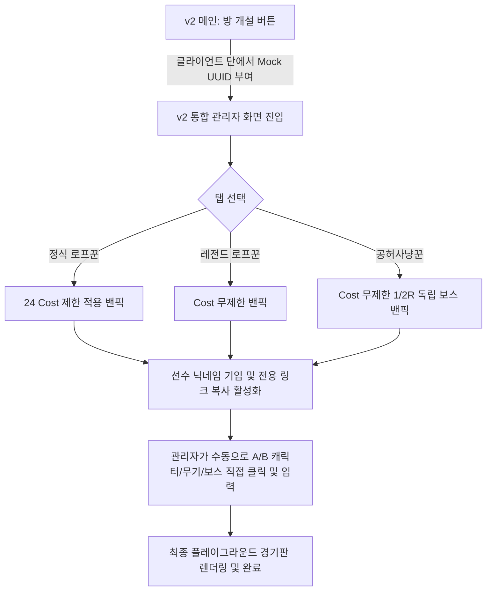

# V2 디자인 시스템 가이드 (DESIGN.md)

해당 문서는 `zzz-picker`의 신규 v2 서비스 및 관리자 UI에 전용으로 적용되는 현대적이고 미니멀한 프리미엄 다크 테마 디자인 규격서입니다. 기존의 파란색/노란색 고대비 v1 스타일에서 벗어나, 젠레스 존 제로(Zenless Zone Zero) 원작 공식 홈페이지의 테크니컬하고 감성적인 다크 카본 및 네온 그린/옐로우 시그니처 톤을 차용하고 극도의 절제미를 제공합니다.

---

## 1. 핵심 디자인 원칙 (Core Principles)

### 1. 완벽한 다크 모드 지향 (Pure Dark Mode)
- 새로운 v2 테마는 라이트 모드 대응을 배제하고 프리미엄급의 **다크 전용 레이아웃**을 일관되게 고수합니다. 눈에 주는 피로를 최소화하며, 어두운 방에서 경기를 제어하는 상황에 극대화된 가독성을 보장합니다.

### 2. 엄격한 미니멀리즘 (Strict Minimalism)
- 과도한 형광색 그림자(Glow 효과)는 UI를 조잡하게 만듭니다. 이를 엄격히 지양합니다.
- 과장된 인터랙션이나 불필요한 장식용 아이콘 남발을 막고, 절제된 레이아웃 안에서 텍스트와 면의 대비를 통해 고급스러운 테크 제품 느낌을 완성합니다.

### 3. 면(Surface) 중심의 레이아웃 분할
- 영역 구분을 위해 빈번하게 Border(선)를 사용하면 화면이 좁고 답답해 보입니다.
- 배경과 각 패널(Card) 간의 **미세한 명도 차이(Depth Elevation)**와 넉넉한 **여백(Padding)**을 통하여 보더 없이 영역을 직관적으로 차별화합니다.

### 4. 소프트 테크-레이어링 (Soft Tech-Layering)
- 글래스모피즘(배경 블러)이나 투박한 뉴모피즘의 단점(가독성 부족, 텁텁함)을 개선하기 위해 레이어의 높낮이 단차를 명도 차이로만 처리합니다.
- 면과 면이 만나는 모서리나 주요 경계에 1px 선 대신, 카드의 입체감을 주는 아주 미세한 안쪽 그림자(inset box-shadow) 또는 그라디언트를 조합하여 미래지향적인 프리미엄 기계 장치 단면과 같은 견고한 매력을 연출합니다.

---

## 2. 디자인 토큰 및 컬러셋 사양

v2 테마는 `html.v2` 클래스가 루트 태그에 선언되었을 때 CSS 변수를 기반으로 제어됩니다.

| 디자인 토큰 (CSS 변수) | 적용 색상 (HEX) | 주요 용도 및 상세 설명 |
| :--- | :--- | :--- |
| `--color-base` | `#0c0f12` | **메인 배경색**. 깊고 무거운 탄소/카본 다크 블랙 그레이 |
| `--color-content` | `#141920` | **콘텐츠 카드 배경색**. 배경보다 미세하게 명도가 높은 차콜 블루 |
| `--color-netural` | `#1c2331` | **비활성 면/버튼 배경색**. 단차 구분을 위한 서브 머티리얼 면 |
| `--color-primary` | `#e2ff3b` | **메인 시그니처 컬러**. 정밀하고 강렬한 형광 네온 옐로우/그린 |
| `--color-secondary` | `#00f0ff` | **서브 하이라이트**. 첨단 테크 느낌을 자아내는 차가운 네온 시아노 |
| `--color-tertiary` | `#ff4500` | **경고 및 잔여 코스트 부족**. 에너제틱한 시그널 오렌지 레드 |
| `--color-ink` | `#ffffff` | **메인 화이트 텍스트**. 눈부심이 없는 깔끔한 흰색 글씨 |
| `--color-disabled` | `#374151` | **비활성화 요소**. 다크 백그라운드 위에서 묻히는 짙은 차콜 그레이 |

---

## 3. UI 및 상태 제어 가이드

### 1. 닉네임 입력 기반 링크 활성화 흐름
A선수 및 B선수의 이름을 입력하기 전과 후에 따른 링크 복사 UI의 활성화 시각 효과를 극명하게 구별합니다.

```text
[ 미입력 상태 - 버튼 비활성화 ]
 ┌───────────────────────────────────────────────┐
 │  A 선수 이름: [ (이름을 입력하세요)        ]  │
 │  [ 링크 복사 ] 🛈 (이름 기입 시 복사 가능)   │ <- 회색조 텍스트, 클릭 차단 (cursor-not-allowed)
 └───────────────────────────────────────────────┘

[ 입력 완료 상태 - 버튼 동적 활성화 ]
 ┌───────────────────────────────────────────────┐
 │  A 선수 이름: [ 제로원                     ]  │
 │  [ 🔗 참가 경로 복사 ]                       │ <- 네온 그린 포인트 컬러 전환, 호버 효과 제공
 └───────────────────────────────────────────────┘
```

### 2. 수동 밴픽 시뮬레이터 조작 흐름
관리자가 참가자의 네트워크 상태에 구애받지 않고 밴픽을 주도할 수 있도록 설계된 로컬 시뮬레이션 상태 머신 흐름입니다.



---

## 4. 관련 룰 구조

| Rule | Description |
| :--- | :--- |
| [게임 규칙 (game-rule)](game-rule.md) | zzz-picker 경기 진행 방식 및 라운드 세부 규칙 |
| [밴픽 규칙 (banpick-rule)](banpick-rule.md) | 캐릭터 Ban & Pick 절차 및 규칙 |
| [캐릭터 및 엔진 코스트 설정 (cost-schema)](cost-schema.md) | 캐릭터 및 W-엔진의 상세 코스트 산정 방법 |
