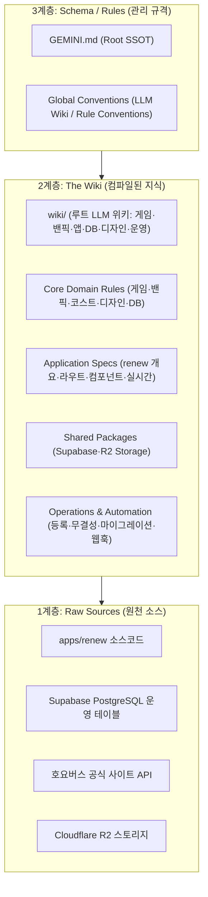

# 엔강대 밴픽 사이트 지식 가이드 (GEMINI.md)

이 프로젝트는 젠레스 존 제로(Zenless Zone Zero)의 강습전 콘텐츠를 기반으로, 2명의 참가자(A/B)와 1명의 호스트(H)가 실시간으로 보스 선택, 밴픽, 파티 구성을 진행하고 최종 점수를 겨루는 경기 운영 플랫폼입니다.

현재 서비스의 단일 진실 공급원(Single Source of Truth)이자 메인 애플리케이션은 **`@zzz-picker/renew` (`apps/renew`)**입니다.

> [!IMPORTANT]
> **LLM Wiki 지식 운영 원칙 (Compilation-First)**:  
> 본 프로젝트의 모든 도메인 지식과 설계 결정은 컴파일-우선 원칙에 따라 구조화되어 관리됩니다.  
> 모든 탐색은 본 최상위 문서(`GEMINI.md`)로부터 탑다운(Top-down) 단방향으로 진행되며, 하위 문서 간의 불필요한 양방향 링크나 상위 역링크는 배제합니다.

---

## 1. LLM Wiki 3계층 아키텍처 (3-Layer Architecture)



| 계층 | 역할 | 주요 대상 |
| :--- | :--- | :--- |
| **3. Schema / Rules** | 에이전트 지식 관리 및 행동 지침 | `GEMINI.md`, `LLM_WIKI_CONVENTIONS.md`, `RULE_CONVENTIONS.md` |
| **2. The Wiki** | 컴파일된 구조화 도메인/앱 지식 | **`wiki/` (루트 LLM 위키)** 및 본 문서의 4대 카테고리 룰 인덱스 |
| **1. Raw Sources** | 불변의 진실의 원천 | Git 코드베이스, Supabase DB, 호요버스 공식 API, R2 버킷 |

---

## 2. 탑다운 단방향 지식 트리 (Knowledge Tree)

```text
.agent/rules/
├── GEMINI.md                          # [Root SSOT] 최상위 허브
│
├── [Core Rules] 핵심 경기 및 도메인 규칙
│   ├── game-rule.md                   # 라운드, 3대 모드, 시간 보너스/점수 공식
│   ├── banpick-rule.md                # 4단계 Phase(보스, 1차밴, 2차밴, 픽)
│   ├── cost-schema.md                 # 24 코스트 제한, 등급/돌파별 코스트 산정
│   ├── zzz-agent.md                   # 에이전트 등급, 특성, 포지션(딜러/서포터)
│   ├── zzz-engine.md                  # W-엔진 등급, 돌파(1~5), 전용 무기
│   ├── DESIGN.md                      # 퓨어 다크 테크니컬 디자인 시스템
│   └── database-schema.md             # Supabase PostgreSQL 전체 스키마 명세
│
├── apps/renew/                        # 메인 서비스 애플리케이션 명세
│   ├── overview.md                    # 기술 스택(Remix, Tailwind v4), 구조
│   ├── routes.md                      # 라우트 명세 (_index, $roomId 등)
│   ├── components.md                  # 컴포넌트 명세 (PlayGround, HostDashboard)
│   └── realtime.md                    # Supabase Realtime 브로드캐스트 이벤트
│
├── packages/                          # 핵심 공유 패키지
│   ├── supabase.md                    # Supabase 싱글톤 클라이언트
│   └── r2-storage.md                  # Cloudflare R2 스토리지 클라이언트
│
└── operations/                        # 데이터베이스 및 운영 관리 허브
    ├── roster-auto-registration.md    # [Hub] 게임 데이터 등록 가이드 및 안전 수칙
    │   ├── faction-registration.md    # 진영(Camp) 등록 규격
    │   ├── agent-registration.md      # 에이전트 및 0~6돌 코스트 등록 규격
    │   ├── engine-registration.md     # W-엔진 및 1~5돌 코스트 등록 규격
    │   ├── boss-registration.md       # 보스 마스터 및 체력 배열 등록 규격
    │   ├── assault-registration.md    # 강습전 시즌 및 4종 보스 라인업 등록 규격
    │   └── hoyoverse-character-api.md # 호요버스 공식 API 엔드포인트 명세
    ├── migrations/
    │   ├── index.md                   # [Hub] DB 마이그레이션 아카이브 인덱스
    │   └── 2026-09-06-legacy-match-log.md # 레거시 경기 로그 1차 이관 명세
    ├── data-integrity-cleanup.md      # 5대 무결성 검사 및 소프트 딜리트 수명주기
    └── discord-webhook-notification.md# 디스코드 웹훅 3대 블록 규격 & 페어리 알림
```

---

## 3. 목적별 고속 쿼리 시나리오 (Fast Query Scenarios)

에이전트는 전체 파일의 무차별 탐색을 지양하고, 수행하려는 작업 목적에 따라 아래 권장 경로를 탑다운으로 탐색합니다.

| 작업 시나리오 | 권장 탐색 순서 | 주요 참조 지식 |
| :--- | :--- | :--- |
| **밴픽/점수/경기 규칙 로직 개발** | `game-rule.md` ➡️ `banpick-rule.md` ➡️ `cost-schema.md` | 라운드별 점수식, 페이즈 전환 흐름, 24코스트 계산 |
| **선수/호스트 UI 및 화면 개발** | `DESIGN.md` ➡️ `apps/renew/overview.md` ➡️ `components.md` ➡️ `routes.md` | 테마 토큰, PlayGround/HostDashboard 반응형 레이아웃 |
| **실시간 동기화/소켓 이벤트 처리** | `apps/renew/realtime.md` ➡️ `packages/supabase.md` | Realtime Broadcast 채널 이벤트 시퀀스 및 페이로드 |
| **신규 캐릭터/엔진/시즌 DB 적재** | `operations/roster-auto-registration.md` ➡️ 해당 도메인 등록 문서 | 원자적 트랜잭션, 멱등성 보장 SQL 템플릿 |
| **경기 데이터 무결성 점검/세션 정리**| `operations/data-integrity-cleanup.md` ➡️ `send-discord-webhook` | 5대 정밀 검사 기준, 소프트 딜리트(isHide) |
| **DB 스키마 변경 및 데이터 이관** | `database-schema.md` ➡️ `operations/migrations/index.md` | 스키마 SSOT 및 일자별 마이그레이션 이력 |

---

## 4. 컴파일된 지식 상세 인덱스 (The Wiki)

> [!TIP]
> 프로젝트 루트에 구축된 **[루트 LLM 위키 (wiki/index.md)](../../wiki/index.md)**를 통해 경기 규칙, 밴픽 시스템, 앱 아키텍처, 데이터베이스, 디자인 시스템, 운영 자동화 지식을 단일 진입점에서 고속으로 종합 조회할 수 있습니다.

### 4.1 핵심 경기 및 도메인 규칙 (Core Rules)

| Rule | File | Description |
| :--- | :--- | :--- |
| **게임 규칙** | [game-rule.md](./game-rule.md) | 라운드 진행 방식, 3개 경기 모드, 시간 보너스 및 코스트 점수 계산식 |
| **밴픽 규칙** | [banpick-rule.md](./banpick-rule.md) | 4단계 Phase(공용보스, 1차 밴, 2차 밴, 픽) 상세 절차 |
| **코스트 설정** | [cost-schema.md](./cost-schema.md) | 캐릭터 및 W-엔진의 등급/돌파별 코스트 산정 공식 및 런타임 구조 |
| **에이전트 정의** | [zzz-agent.md](./zzz-agent.md) | 캐릭터 특성(Specialty), 포지션(딜러/서포터), 돌파 정의 |
| **엔진 정의** | [zzz-engine.md](./zzz-engine.md) | W-엔진 등급, 돌파(1~5), 전용 무기 정의 |
| **디자인 시스템** | [DESIGN.md](./DESIGN.md) | 퓨어 다크 테크니컬 디자인 토큰, 컬러셋, 레이아웃 규격서 |
| **데이터베이스** | [database-schema.md](./database-schema.md) | Supabase PostgreSQL 스키마 및 핵심 테이블 명세 |

### 4.2 메인 애플리케이션 가이드 (App: renew)

| Guide | File | Description |
| :--- | :--- | :--- |
| **앱 개요** | [apps/renew/overview.md](./apps/renew/overview.md) | 기술 스택(Remix, Tailwind v4), 디렉토리 구조, 의존성 정책 |
| **라우트 명세** | [apps/renew/routes.md](./apps/renew/routes.md) | 메인 홈(`_index`), 경기장(`$roomId`), 방 조회, 월페이퍼, 계산기 |
| **컴포넌트 명세** | [apps/renew/components.md](./apps/renew/components.md) | PlayGround(선수용), HostDashboard(호스트용), CreateRoom 등 UI 구성 |
| **실시간 통신** | [apps/renew/realtime.md](./apps/renew/realtime.md) | Supabase Realtime 브로드캐스트 이벤트 및 페이즈 전이 시퀀스 |

### 4.3 핵심 공유 패키지 가이드 (Packages)

| Package | File | Description |
| :--- | :--- | :--- |
| **Supabase 연동** | [packages/supabase.md](./packages/supabase.md) | Supabase 클라이언트 단일 인스턴스 및 DB 도구 |
| **R2 스토리지** | [packages/r2-storage.md](./packages/r2-storage.md) | Cloudflare R2 버킷 클라이언트 및 이미지 업로드 유틸리티 |

### 4.4 데이터베이스 및 운영 관리 규칙 (Database & Operations)

| Guide | File | Description |
| :--- | :--- | :--- |
| **등록 가이드 허브** | [operations/roster-auto-registration.md](./operations/roster-auto-registration.md) | 캐릭터/엔진/보스/강습전 데이터 등록 허브 및 공통 안전 수칙 |
| **진영 등록** | [operations/faction-registration.md](./operations/faction-registration.md) | 진영 마스터, 호요버스 Camp API 연동 및 로고 이미지 매핑 |
| **에이전트 등록** | [operations/agent-registration.md](./operations/agent-registration.md) | 에이전트 프로필 및 0~6돌 7개 코스트(5대 프리셋) 등록 규격 |
| **W-엔진 등록** | [operations/engine-registration.md](./operations/engine-registration.md) | W-엔진 스펙, 전용 무기 연결 및 1~5돌 코스트 등록 규격 |
| **보스 마스터 등록** | [operations/boss-registration.md](./operations/boss-registration.md) | 보스 마스터 및 체력(HP) 배열 등록 규격 |
| **강습전 시즌 등록** | [operations/assault-registration.md](./operations/assault-registration.md) | 강습전 시즌 및 4종 보스(trial/adversity) 라인업 매핑 규격 |
| **호요버스 공식 API** | [operations/hoyoverse-character-api.md](./operations/hoyoverse-character-api.md) | 호요버스 공식 사이트 API 구조도, 속성/특성 한자 변환 사전 |
| **DB 마이그레이션 허브** | [operations/migrations/index.md](./operations/migrations/index.md) | 일자별 DB 마이그레이션 명세 및 레거시 데이터 이관 허브 |
| **무결성 & 수명주기** | [operations/data-integrity-cleanup.md](./operations/data-integrity-cleanup.md) | 5대 체크리스트 기반 정상 경기 승격 및 소프트 딜리트(isHide) 규격 |
| **디스코드 웹훅 알림** | [operations/discord-webhook-notification.md](./operations/discord-webhook-notification.md) | 디스코드 웹훅 3대 블록 규격 및 페어리 알림 운영 규칙 |

---

## 5. 지식 ➡️ 실행 도구 연계 (Rules to Skills Mapping)

지식 베이스의 운영 규칙은 자동화된 실행 도구(Skills)와 1:1로 매핑되어 있습니다.

| 운영 규칙 (Rule) | 실행 스킬 (Skill) | 스킬 경로 | 설명 |
| :--- | :--- | :--- | :--- |
| **에이전트 등록 규칙** | `register-agent` | [register-agent](../skills/register-agent/SKILL.md) | 호요버스 공식 API/팬덤 위키 기반 에이전트 메타데이터 취합 및 등록 |
| **데이터 무결성 및 수명주기** | `sync-match-integrity` | [sync-match-integrity](../skills/sync-match-integrity/SKILL.md) | 5대 체크리스트 기반 무결성 동기화 및 방치 세션 소프트 딜리트 |
| **진영 등록 규칙** | `register-faction` | [register-faction](../skills/register-faction/SKILL.md) | 호요버스 Camp API 조회 기반 신규 진영 메타데이터/로고 등록 |
| **특성 등록 규칙** | `register-specialty` | [register-specialty](../skills/register-specialty/SKILL.md) | 호요랩 위키 필터 API 기반 신규 특성 메타데이터/아이콘 등록 |
| **디스코드 웹훅 알림** | `send-discord-webhook` | [send-discord-webhook](../skills/send-discord-webhook/SKILL.md) | 규격화된 3대 블록 기반 디스코드 알림 및 브리핑 전송 |
| **R2 스토리지 가이드** | `upload-r2-image` | [upload-r2-image](../../.cursor/skills/upload-r2-image/SKILL.md) | 이미지 R2 버킷 업로드 및 공개 CDN URL 발급 |

---
*이 문서는 Gemini 기반 에이전트들이 프로젝트의 전체 규칙과 아키텍처를 탐색하는 단일 최상위 진실 공급원(SSOT)입니다.*

