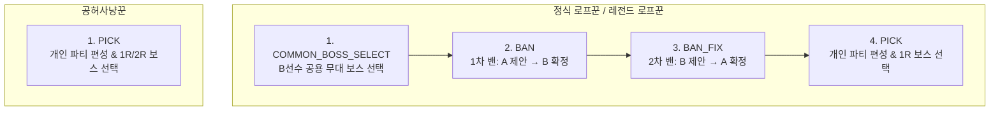

# 밴픽 규칙 (Ban & Pick Rule)

`zzz-picker`의 실시간 밴픽은 경기 모드에 따라 4단계의 `Phase` 상태 머신을 거쳐 진행됩니다.

---

## 1. 경기 모드별 진행 단계

---

## 2. 세부 진행 단계 (Phase Steps)

### Phase 1: 공용 보스 선택 (`COMMON_BOSS_SELECT`)
- **대상 모드**: `정식 로프꾼`, `레전드 로프꾼`
- **행동 주체**: **B선수**
- B선수가 이번 매치 2라운드에서 양측이 공통으로 상대할 공용 무대 보스 1종을 선택하고 확정합니다.

### Phase 2: 1차 밴 (`BAN`)
1. **A선수 제안**: A선수가 **S급 픽업 캐릭터 2명**을 제안 후보(`proposeBan`)로 선택합니다.
   - 단, 서버 또는 룸 설정에 의해 지정된 **보호 캐릭터(Allow Agent)**는 밴 후보로 선택할 수 없습니다.
   - 티저/미출시 캐릭터는 선택할 수 없습니다.
2. **B선수 확정**: B선수가 A선수가 제안한 2명의 캐릭터 중 **1명을 선택하여 최종 밴(`selectBan`)**합니다.

### Phase 3: 2차 밴 (`BAN_FIX`)
1. **B선수 제안**: B선수가 **1차 밴된 캐릭터와 다른 포지션**의 **S급 픽업 캐릭터 2명**을 제안 후보로 선택합니다.
   - 포지션 구분: **딜러(강공, 명파, 이상)** $\longleftrightarrow$ **서포터(지원, 격파, 방어)**
   - 예: 1차 밴이 '강공(딜러)'이었다면, 2차 밴 제안은 반드시 '서포터(지원/격파/방어)' 캐릭터만 선택 가능합니다.
2. **A선수 확정**: A선수가 B선수가 제안한 2명의 캐릭터 중 **1명을 선택하여 최종 밴**합니다.
3. 양측 1명씩 총 2명의 캐릭터가 최종 밴 리스트에 등록됩니다.

### Phase 4: 픽 페이즈 (`PICK`)
- 각 선수는 **1라운드(1R)**와 **2라운드(2R)**에 출전할 독립된 2개의 파티를 구성합니다.
  - **에이전트**: 라운드당 3명 (두 라운드 합산 총 6명, 중복 선택 불가)
  - **W-엔진**: 각 에이전트 슬롯에 전용 또는 공용 W-엔진 장착 가능
  - **돌파 수치**: 에이전트(0~6돌), W-엔진(1~5돌) 조절
- **정식 로프꾼**: 총 코스트가 24 Cost를 넘지 않도록 조합하는 것이 유리합니다 (초과 시 감점).
- **공허사냥꾼**: 보스 선택 및 밴 없이 방 입장 즉시 픽 페이즈를 시작하며, 1R와 2R 보스를 자유롭게 개별 선택합니다.

