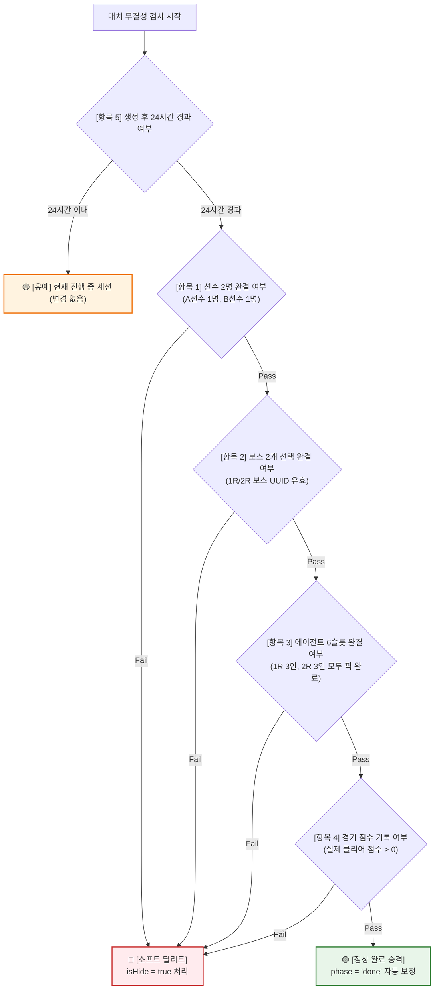

# 데이터 무결성 검사 및 소프트 딜리트 수명주기 규칙 (Data Integrity & Soft-Delete Lifecycle)

실시간 밴픽 서비스 특성상 방 생성 후 이탈하거나 중단되어 방치되는 세션이 발생합니다.  
데이터베이스의 물리적 데이터 유실을 방지하고 통계 신뢰성을 확보하기 위해, **하드 딜리트(DELETE)를 일체 배제하고 `isHide` 플래그 기반의 소프트 딜리트(은닉) 및 정상 경기 자동 완료(`phase='done'`) 승격** 정책을 적용합니다.

---

## 1. 경기 무결성 5대 정밀 검사 기준 (Checklist)

하나의 매치를 검사할 때, 아래 5가지 세부 항목을 순차적으로 검증하여 정상 여부를 판단합니다.



### 세부 검사 항목표

| 검사 항목 | 검사 대상 필드 | 통과 기준 (PASS) | 이상치 기준 (FAIL) |
| :--- | :--- | :--- | :--- |
| **1. 참가자 완결성** | `COUNT(play.id)`, `role` | A선수 1명, B선수 1명 **정확히 2명** 존재 | 선수가 0명이거나 1명뿐인 방치 룸 |
| **2. 보스 선택 완결성** | `play.boss` (`uuid[]`) | 1R/2R 보스 2개가 모두 유효한 UUID로 채워짐 | 보스가 `[null, null]`이거나 결손된 상태 |
| **3. 파티 슬롯 완결성** | `play.agentSlot` (`jsonb`) | 1R(3명) + 2R(3명) **총 6개 슬롯 모두 캐릭터 ID 존재** | 픽 도중 나가서 슬롯에 `null`이 남아있는 상태 |
| **4. 점수/시간 완결성** | `play.score`, `time` | 실제 클리어 점수가 1건이라도 유효하게 기록됨 (`score > 0`) | 양 선수 모두 1R/2R 점수가 `0`점이고 시간도 `0`초 |
| **5. 유예 기간 (Grace)** | `match."createdAt"` | 생성된 지 **24시간 이내**인 방은 진행 중으로 인정 | 생성 후 **24시간 이상** 경과한 방에만 최종 판정 적용 |

---

## 2. 2-Pass 라이프사이클 처리 동작

1. **🟢 정상 완료 승격 (Promotion to `phase = 'done'`)**:
   - **대상**: 5대 항목(선수 2명, 보스 2개, 6인 슬롯, 점수 > 0)을 모두 충족했으나, 호스트가 마지막 종료 버튼을 누르지 않아 `'pick'` 상태로 남아있는 경기.
   - **조치**: `UPDATE public.match SET phase = 'done' WHERE id = ...;`
   - **효과**: 이용자들의 소중한 실제 플레이 기록을 정식 공식 경기로 구제.

2. **🔴 비정상/방치 세션 은닉 (Soft-Delete `isHide = true`)**:
   - **대상**: 항목 1~4 중 어느 하나라도 결손이 발생한 채 **24시간 이상 방치된 룸**.
   - **조치**: `UPDATE public.match SET "isHide" = true WHERE id = ...;`
   - **효과**: 물리적 삭제 없이 화면 및 랭킹/통계 조회에서 안전하게 숨김 처리.

3. **🟡 실시간 진행 세션 보호 (Grace Period)**:
   - **대상**: 생성된 지 24시간이 지나지 않은 활성 룸.
   - **조치**: 어떤 플래그도 변경하지 않고 원형 유지.

4. **📢 디스코드 브리핑 연동 ([discord-webhook-notification.md](./discord-webhook-notification.md))**:
   - **조치**: 동기화 완료 후 [`send-discord-webhook`](../../skills/send-discord-webhook/SKILL.md) 스킬을 호출하여 디스코드 채널에 대민 친화적 요약 카드를 자동 전송.
   - **장애 대응**: 동기화 중 오류 발생 시 즉시 `system-failure` 카드로 실패 작업명과 에러 로그 긴급 보고.

---

## 3. PostgreSQL 무결성 동기화 함수 (`sync_match_integrity`)

```sql
CREATE OR REPLACE FUNCTION sync_match_integrity()
RETURNS jsonb AS $$
DECLARE
  promoted_done_count int := 0;
  hidden_matches_count int := 0;
BEGIN
  -- 1. 전체 매치 항목별 무결성 진단 임시 테이블 생성
  CREATE TEMP TABLE tmp_integrity_eval ON COMMIT DROP AS
  SELECT 
    m.id,
    m.phase,
    -- 항목 1: 선수 2명 완결 여부
    (COUNT(p.id) = 2 AND COUNT(DISTINCT p.role) = 2) as pass_players,
    -- 항목 2: 보스 2개 선택 완결 여부
    bool_and(array_length(p.boss, 1) = 2 AND p.boss[1] IS NOT NULL AND p.boss[2] IS NOT NULL) as pass_bosses,
    -- 항목 3: 에이전트 6슬롯 완결 여부
    bool_and(
      jsonb_array_length(p."agentSlot") = 2 AND
      (p."agentSlot"->0->0->>'id') IS NOT NULL AND
      (p."agentSlot"->0->1->>'id') IS NOT NULL AND
      (p."agentSlot"->0->2->>'id') IS NOT NULL AND
      (p."agentSlot"->1->0->>'id') IS NOT NULL AND
      (p."agentSlot"->1->1->>'id') IS NOT NULL AND
      (p."agentSlot"->1->2->>'id') IS NOT NULL
    ) as pass_agent_slots,
    -- 항목 4: 점수 기록 완결 여부
    bool_or(p.score[1] > 0 OR p.score[2] > 0) as pass_scores,
    -- 항목 5: 24시간 경과 여부
    (m."createdAt" < NOW() - INTERVAL '24 hours') as is_expired
  FROM public.match m
  LEFT JOIN public.play p ON p."matchId" = m.id
  WHERE m."isHide" = false -- 이미 숨겨진 방은 재평가 제외
  GROUP BY m.id, m.phase, m."createdAt";

  -- [Pass 1] 정상 완결 경기 phase = 'done' 자동 승격
  WITH promoted AS (
    UPDATE public.match
    SET phase = 'done'
    WHERE id IN (
      SELECT id FROM tmp_integrity_eval
      WHERE phase != 'done'
        AND pass_players = true 
        AND pass_bosses = true 
        AND pass_agent_slots = true 
        AND pass_scores = true
    )
    RETURNING id
  )
  SELECT count(*) INTO promoted_done_count FROM promoted;

  -- [Pass 2] 24시간 이상 방치된 결손/미완료 방 isHide = true 소프트 딜리트
  WITH hidden AS (
    UPDATE public.match
    SET "isHide" = true
    WHERE id IN (
      SELECT id FROM tmp_integrity_eval
      WHERE is_expired = true
        AND (pass_players = false OR pass_bosses = false OR pass_agent_slots = false OR pass_scores = false)
    )
    RETURNING id
  )
  SELECT count(*) INTO hidden_matches_count FROM hidden;

  RETURN jsonb_build_object(
    'promoted_to_done', promoted_done_count,
    'hidden_stale_matches', hidden_matches_count
  );
END;
$$ LANGUAGE plpgsql;
```

---

## 4. 프론트엔드/서비스 조회 표준 가이드

모든 경기 목록, 랭킹, 통계, 관리자 조회 쿼리는 아래 조건을 기본 반영합니다:

```typescript
// 서비스 기본 조회 조건
const query = supabase
  .from('match')
  .select('*')
  .eq('isHide', false); // 소프트 딜리트 제외
```

---

## 5. 실행 스킬 연계 (Execution Skills)

| 스킬 | 경로 | 설명 |
| :--- | :--- | :--- |
| **경기 무결성 동기화 스킬** | [sync-match-integrity](../../skills/sync-match-integrity/SKILL.md) | 5대 체크리스트 기반 무결성 동기화 실행 AI Skill |
| **디스코드 웹훅 발송 스킬** | [send-discord-webhook](../../skills/send-discord-webhook/SKILL.md) | 규격화된 블록 기반 디스코드 알림 및 무결성 브리핑 전송 |
