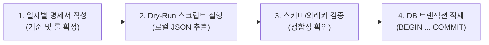

# 데이터베이스 마이그레이션 허브 (Migration Index)

zzz-picker의 데이터베이스 스키마 변경, 레거시 데이터 이관, 데이터 정제 작업의 일자별 명세서를 아카이빙하고 관리하는 최상위 인덱스입니다.  
에이전트는 불필요한 전체 탐색을 방지하기 위해, 필요한 작업 일자의 명세서만 선별하여 탐색합니다.

---

## 1. 마이그레이션 절대 운영 원칙

1. **원천 데이터 보존 (Read-Only)**: 레거시 테이블 및 기존 운영 데이터는 오직 `SELECT`로만 접근하며 원본을 변경하거나 삭제하지 않습니다.
2. **사전 검증 필수 (Dry-Run First)**: DB에 데이터를 쓰기 전, 반드시 로컬 JSON 추출 및 타입/외래키 정합성 검증을 완료합니다.
3. **원자적 트랜잭션 (Atomic Transaction)**: 모든 적재 작업은 단일 PostgreSQL 트랜잭션(`BEGIN ... COMMIT`)으로 실행하여 실패 시 자동 롤백되도록 합니다.
4. **일자별 독립 명세화**: 작업 단위마다 별도 일자별 명세서를 작성하여 컨텍스트 오염을 방지합니다.

---

## 2. 일자별 마이그레이션 아카이브 (Migration History)

| 작업 일자 | 마이그레이션 명칭 | 대상 테이블 (From ➡️ To) | 상태 | 명세서 파일 |
| :--- | :--- | :--- | :---: | :--- |
| **2026-09-06** | 레거시 경기 로그 1차 무결성 이관 | 레거시 5종 로그 ➡️ `match`, `play` | **완료 (Success, 39건)** | [2026-09-06-legacy-match-log.md](./2026-09-06-legacy-match-log.md) |
| **(예정)** | 미식별 W-엔진(12종) 매핑 및 2차 이관 | 레거시 보류 경기(52건) ➡️ `play` | 보류 (Pending) | TBD |

---

## 3. 표준 마이그레이션 파이프라인

---

## 4. 하위 마이그레이션 명세 (Sub Rules)

| Rule | Description |
| :--- | :--- |
| [2026-09-06 레거시 이관 명세](./2026-09-06-legacy-match-log.md) | 2026-09-06 레거시 경기 로그 3단계 분류 및 1차 이관 명세서 |
