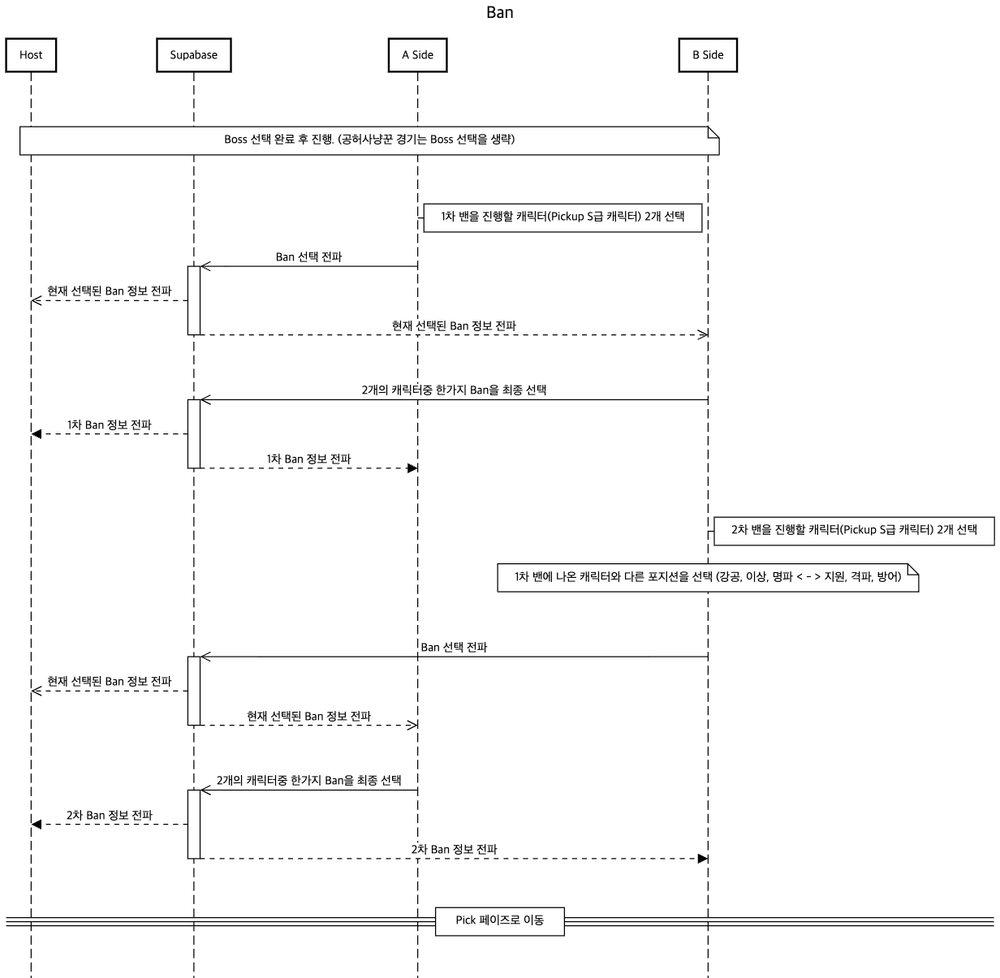

# Realtime Ban

**Ban**의 경우 Boss(공용무대) 선택이 종료된 후 진행됩니다. `공허사냥꾼`경기인 경우 Boss 선택은 스킵되며, 바로 Ban을 진행합니다.

밴픽에 대한 자세한 설명은 `.agent/rules/banpick-rule.md`를 참고합니다.

캐릭터에 대한 자세한 설명은 `.agent/rules/zzz-agent.md`를 참고합니다.

## Sequence Diagram

아래의 이미지를 참고하여, Ban에 대한 스텝을 이해하세요.

## 캐릭터(에이전트) 포지션

캐릭터는 6가지 특성(`specialty`)중 한가지를 가지는데, 이 특성(`specialty`)을 기반으로 `서포터`, `딜러`구분을 합니다.

- **딜러**: `강공`, `이상`, `명파`
- **서포터**: `지원`, `격파`, `방어`

## Ban이 가능한 캐릭터 조건

- Pickup S등급 캐릭터만 밴이 가능합니다. `isPickup`값과 `rarity`값을 확인하세요.
- `Allow Agent`인 경우 밴이 불가능합니다. `isAllow`값을 참고하세요.
- 티저 캐릭터의 경우 선택 자체가 불가능합니다. `isTeaser`값을 참고하세요.
