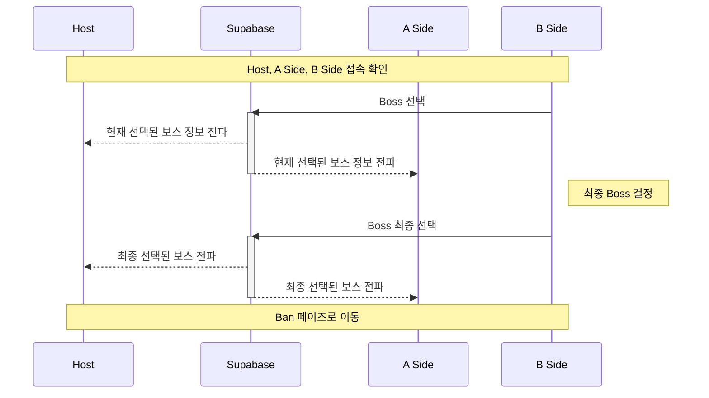

# Realtime Boss Select

**보스(공용무대) 선택**은 `정식 로프꾼`, `레전드 로프꾼`경기에서만 사용됩니다.

밴픽에 대한 자세한 설명은 [banpick-rule.md](../banpick-rule.md)를 참고합니다.

## Sequence Diagram

아래의 다이어그램을 참고하여, Boss 선택에 대한 스텝을 이해하세요.




## Boss List

Boss List의 경우 아래의 조건에 맞추어 리스트업 됩니다.

- `open`을 기준으로, 내림차순으로 정렬합니다.
- 현재 시간을 기준으로 가장 앞에 있는 이전 일시의 데이터를 찾습니다.
- 해당 데이터에 있는 `boss1`, `boss2`, `boss3`을 리스트로 구성하여 최종 3개로 구성된 Boss Map을 구성합니다.

아래는 해당 Boss List를 구하는 예시 코드입니다.

```tsx
import { pipe, map, toArray, join, find, sort, isUndefined, throwIf } from '@fxts/core'
import { useStore } from '@zzz-picker/provider/hooks'
import dayjs from 'dayjs'
import { useMemo } from 'react'

const useCurrentBossList = () => {
  const { deadlyAssaultList, boss } = useStore()

  return useMemo(() => {
    try {
      return pipe(
        deadlyAssaultList,
        sort((prev, curr) => curr.open.diff(prev.open)),
        find((deadlyAssault) => dayjs(deadlyAssault.open).isBefore(dayjs())),
        throwIf(isUndefined, () => Error('')),
        ({ boss1, boss2, boss3 }) => [boss1, boss2, boss3]
      )
    } catch {
      return [null, null, null]
    }
  }, [deadlyAssaultList, boss])
}
```
