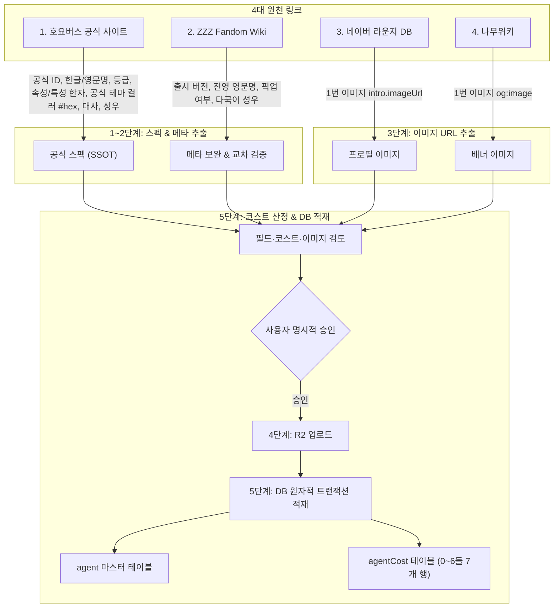

# 에이전트 등록 자동화 스킬 (register-agent)

이 스킬은 젠레스 존 제로(ZZZ)의 신규/기존 에이전트(캐릭터)를 우리 데이터베이스(`agent`, `agentCost`, `image`)에 원자적으로 등록하기 위해, **4개 웹 사이트 URL**로부터 스펙 메타데이터와 프로필/배너 이미지를 정밀하게 추출·취합하고 Cloudflare R2 스토리지 업로드 및 DB 적재를 완결하는 운영 스킬입니다.

> [!NOTE]
> **엔진(W-Engine) 주입 배제 원칙**:  
> W-엔진 등록 및 전용 무기 연결은 본 스킬 범위에서 제외합니다. 별도 엔진 등록 skill은 없으며 `.agent/rules/operations/engine-registration.md`를 따릅니다.

---

## 1. 입력 인터페이스 (4대 입력 링크)

스킬 실행 시 사용자로부터 아래 4개의 사이트 URL을 입력받습니다:

1. **호요버스 공식 캐릭터 URL**: `https://zenless.hoyoverse.com/ko-kr/character?id={id}`
2. **ZZZ Fandom Wiki URL**: `https://zenless-zone-zero.fandom.com/wiki/{Character_Name}`
3. **네이버 게임 라운지 DB URL**: `https://game.naver.com/lounge/ZZZ/db/photo/{ObjectId}`
4. **나무위키 문서 URL**: `https://namu.wiki/w/{캐릭터명}`

---

## 2. 전체 실행 파이프라인 (5-Step Pipeline)



---

### [1단계] 호요버스 공식 API 데이터 파싱 (스펙 & 컬러 SSOT)

호요버스 공식 웹페이지는 CSR 구조이므로, URL의 `id` 쿼리 파라미터를 파싱하여 공식 정적 API를 직접 호출합니다.

1. **호요버스 공식 ID 추출**: URL에서 `id` 파라미터 추출 (예: `162652`)
2. **공식 정적 API 호출**:
   ```http
   GET https://sg-public-api-static.hoyoverse.com/content_v2_user/app/3e9196a4b9274bd7/getContent?iInfoId={id}&iChanId=287&sLangKey=ko-kr
   ```
3. **핵심 필드 추출 (`data.sExt` JSON 파싱)**:
   - **`id`**: `data.iInfoId` (bigint, 호요버스 공식 고유번호)
   - **`nameKo` / `fullNameKo`**: 원본 `sExt["chara-name"]`를 사용합니다. `fullNameKo`에는 원문 전체를 저장하고, `nameKo`는 첫 번째 가운뎃점(`·`) 앞의 단축명을 저장합니다.
   - **`nameEn` / `fullNameEn`**: 원본 `sExt["chara-name-en"]`를 사용합니다. `fullNameEn`에는 원문 전체를 저장하고, `nameEn`은 첫 번째 단어를 저장합니다.
   - **`rarity`**: `sExt["level-icon"][0].name` 파싱 (`"srank (1).png"` ➡️ `'S'`, A급 ➡️ `'A'`)
   - **`attributeId` (속성)**: `sExt["prop-icon-1"][0].name` 한자 파싱 후 DB UUID 매핑
     - `物理` ➡️ 물리 / `火` ➡️ 불 / `冰` ➡️ 얼음 / `电` ➡️ 전기 / `以太` ➡️ 에테르 / `风` ➡️ 바람 / `光` ➡️ 루멘
   - **`specialtyId` (특성)**: `sExt["prop-icon-2"][0].name` 한자 파싱 후 DB UUID 매핑
     - `强攻` ➡️ 강공 / `击破` ➡️ 격파 / `异常` ➡️ 이상 / `支援` ➡️ 지원 / `防护` ➡️ 방어 / `命破` ➡️ 명파
   - **`color` (테마 헥스컬러)**: `sExt["chara-color"]` (예: `"#c3a5ff"`) ➡️ **공식 디자인팀 지정 고유 테마 헥스코드 100% 반영**
   - **대표 대사**: `sExt["chara-line"]`
   - **한국어 성우**: `sExt["chara-cv1-name"]` (예: `'임지연'`)

HTTP 오류, 비정상 `retcode`, JSON 파싱 오류 또는 필수 필드 누락이 있으면 등록을 중단합니다. 공식 출처와 보조 출처의 값이 충돌하면 임의로 선택하지 말고 사용자에게 차이를 보여줍니다.

---

### [2단계] ZZZ Fandom Wiki 데이터 보완 및 교차 검증

공식 API에 누락된 메타데이터를 Fandom Wiki HTML 인포박스(`<aside class="portable-infobox">`)에서 보완합니다.

1. **출시 버전 (`version`)**: `<div data-source="releaseDate">` 내 `Version 2.7` ➡️ `2.7`
2. **소속 진영 (`faction`)**: `<div data-source="faction">` 내 진영 영문명(예: `Angels of Delusion`) ➡️ 우리 DB `faction` 테이블 조회하여 `factionId`(`161790`, AOD) 매핑
3. **한정 픽업 여부 (`isPickup`)**: 본문 Signal Search 이력 및 S급 여부로 `true` / `false` 판별
4. **다국어 성우진**: `<div data-source="voiceKR">`, `voiceEN`, `voiceJP`, `voiceCN`

---

### [3단계] 이미지 URL 추출 (네이버 1번 & 나무위키 1번)

1. **프로필 이미지 (네이버 게임 라운지 DB)**:
   - 네이버 라운지 내부 API 호출:
     ```http
     GET https://comm-api.game.naver.com/nng_main/v1/game/db/character/objectId/{ObjectId}
     ```
   - **추출 대상**: **1번 이미지 (`intro.imageUrl`)**
     - 예: `https://nng-phinf.pstatic.net/.../Nangong_Yu1.png`
2. **배너 이미지 (나무위키)**:
   - 나무위키 HTML 파싱:
     - `<meta property="og:image" content="...">` 태그 조회
   - **추출 대상**: **1번 이미지 (`og:image`)**
     - 예: `https://i.namu.wiki/i/uXhhVQfO...webp`

### [승인 전 사전 확인]

`.agent/rules/operations/roster-auto-registration.md`의 공통 안전 수칙을 적용합니다.

1. DB에서 동일 에이전트 ID와 연결 이미지 행을 조회합니다. 기존 이미지 URL이 정상 연결된 에이전트는 기본적으로 재사용합니다.
2. `specialtyId`, `attributeId`, `factionId` 대상 행이 존재하는지 확인합니다. 외래키 대상이 없거나 이름·ID 매핑이 모호하면 등록을 중단합니다.
3. 전체 등록·갱신 필드, 출처 간 차이, 이미지 원본 URL, `isPickup`·`isAllow`·`isTeaser`, 선택한 코스트 배열을 사용자에게 미리 보여줍니다.
4. 명시적 승인을 받은 뒤에만 이미지 업로드를 시작합니다. 승인된 값에서 변경이 생기면 다시 검토받습니다.

---

### [4단계] R2 이미지 업로드

승인 후 `.cursor/skills/upload-r2-image/SKILL.md`에 따라 이미지를 업로드합니다. 이 단계에서는 DB를 변경하지 않고, 성공한 각 업로드의 CDN URL과 R2 key를 기록합니다. 기존 CDN URL이 있으면 기존 `image.id`를 사용합니다.

1. **프로필 이미지 업로드**:
   ```bash
   npx tsx .cursor/skills/upload-r2-image/scripts/upload.ts \
     --url "{naver_profile_url}" \
     --path "agents/profiles"
   ```
   - 반환된 CDN URL(`https://images.zzz.freevue.dev/agents/profiles/...`)과 R2 key를 기록합니다.

2. **배너 이미지 업로드**:
   ```bash
   npx tsx .cursor/skills/upload-r2-image/scripts/upload.ts \
     --url "{namu_banner_url}" \
     --path "agents/banners"
   ```
   - 반환된 CDN URL(`https://images.zzz.freevue.dev/agents/banners/...`)과 R2 key를 기록합니다.

업로드 일부가 실패하면 DB 쓰기를 시작하지 않습니다. 성공한 URL은 보관하고 재시도 때 다시 업로드하지 않습니다.

---

### [5단계] 0~6돌 코스트 산정 및 DB 원자적 트랜잭션 적재

1. **0~6돌 7개 돌파 코스트 자동 산정 (`agentCost`)**:
   - 등급(`rarity`) 및 픽업 여부(`isPickup`) 기반 5대 표준 프리셋 적용:
     - **Preset 1 (0.5 단위 픽업)**: `[0, 0.5, 1, 1.5, 2, 2.5, 3]` (일반 S급 픽업 에이전트 기본값)
     - **Preset 2 (1.0 단위 픽업)**: `[0, 1, 2, 3, 4, 5, 6]` (고효율 딜러/돌파 체감형)
     - **Preset 3 (1코 시작 강력형)**: `[1, 2, 3, 4, 5, 6, 7]` (미야비 등 압도적 성능)
     - **Preset 4 (4돌 1코 상시형)**: `[0, 0, 0, 0, 1, 1, 1]` (S급 상시 캐릭터)
     - **Preset 5 (0코스트 무료형)**: `[0, 0, 0, 0, 0, 0, 0]` (콜레다 및 A급 캐릭터 전원)

2. **Supabase DB 일괄 적재 SQL (원자적 트랜잭션)**:

   기존에 같은 CDN URL이 있으면 그 `image.id`를 재사용합니다. 신규 URL은 아래 이미지 행과 에이전트·코스트 행을 같은 트랜잭션으로 적재합니다.

   ```sql
   BEGIN;

   -- 기존 URL은 기존 id를 사용하고, 신규 URL은 새 UUID를 사용합니다.
   INSERT INTO public.image (id, src, type, description)
   VALUES ('{profileImageId}', '{profile_cdn_url}', 'agent_profile', '{nameKo} 프로필 아이콘')
   ON CONFLICT (id) DO UPDATE SET
     src = EXCLUDED.src,
     type = EXCLUDED.type,
     description = EXCLUDED.description;

   INSERT INTO public.image (id, src, type, description)
   VALUES ('{bannerImageId}', '{banner_cdn_url}', 'agent_banner', '{nameKo} 전신 배너 일러스트')
   ON CONFLICT (id) DO UPDATE SET
     src = EXCLUDED.src,
     type = EXCLUDED.type,
     description = EXCLUDED.description;

   -- 1. 에이전트 마스터 등록
   INSERT INTO public.agent (
     id,
     "nameKo",
     "nameEn",
     "fullNameKo",
     "fullNameEn",
     rarity,
     "specialtyId",
     "attributeId",
     "factionId",
     color,
     version,
     "isPickup",
     "isAllow",
     "isTeaser",
     "profileImageId",
     "bannerImageId"
   ) VALUES (
     {id},
     '{nameKo}',
     '{nameEn}',
     '{fullNameKo}',
     '{fullNameEn}',
     '{rarity}',
     '{specialtyId}',
     '{attributeId}',
     {factionId},
     '{color}',
     {version},
     {isPickup},
     {isAllow},
     {isTeaser},
     '{profileImageId}',
     '{bannerImageId}'
   ) ON CONFLICT (id) DO UPDATE SET
     "nameKo" = EXCLUDED."nameKo",
     "nameEn" = EXCLUDED."nameEn",
     "fullNameKo" = EXCLUDED."fullNameKo",
     "fullNameEn" = EXCLUDED."fullNameEn",
     rarity = EXCLUDED.rarity,
     "specialtyId" = EXCLUDED."specialtyId",
     "attributeId" = EXCLUDED."attributeId",
     "factionId" = EXCLUDED."factionId",
     color = EXCLUDED.color,
     version = EXCLUDED.version,
     "isPickup" = EXCLUDED."isPickup",
     "isAllow" = EXCLUDED."isAllow",
     "isTeaser" = EXCLUDED."isTeaser",
     "profileImageId" = COALESCE(EXCLUDED."profileImageId", agent."profileImageId"),
     "bannerImageId" = COALESCE(EXCLUDED."bannerImageId", agent."bannerImageId");

   -- 2. agentCost 0~6돌 7개 행 생성 (Preset 1 예시: [0, 0.5, 1, 1.5, 2, 2.5, 3])
   INSERT INTO public."agentCost" ("agentId", rate, cost) VALUES
     ({id}, 0, 0),
     ({id}, 1, 0.5),
     ({id}, 2, 1),
     ({id}, 3, 1.5),
     ({id}, 4, 2),
     ({id}, 5, 2.5),
     ({id}, 6, 3)
   ON CONFLICT ("agentId", rate) DO UPDATE SET cost = EXCLUDED.cost;

   COMMIT;
   ```

   SQL 실패 시 DB 트랜잭션 전체를 롤백하고 기존 R2 URL을 재사용해 재시도합니다. 재시도 때 새 업로드를 만들지 않습니다.

---

## 3. 사후 검증 쿼리

```sql
SELECT 
  a.id,
  a."nameKo",
  a.rarity,
  a.color,
  a.version,
  a."isPickup",
  f."nameKo" as faction_name,
  pi.src as profile_url,
  bi.src as banner_url,
  COUNT(ac.id) as cost_count,
  array_agg(ac.rate ORDER BY ac.rate) as rate_array,
  json_agg(ac.cost ORDER BY ac.rate) as cost_array
FROM public.agent a
LEFT JOIN public.faction f ON f.id = a."factionId"
LEFT JOIN public.image pi ON pi.id = a."profileImageId"
LEFT JOIN public.image bi ON bi.id = a."bannerImageId"
LEFT JOIN public."agentCost" ac ON ac."agentId" = a.id
WHERE a.id = {id}
GROUP BY a.id, a."nameKo", a.rarity, a.color, a.version, a."isPickup", f."nameKo", pi.src, bi.src;
```
- **검증 기준**:
  - `cost_count`: **정확히 7개**, `rate_array`: `[0, 1, 2, 3, 4, 5, 6]`
  - `profile_url`, `banner_url`: Cloudflare R2 CDN 정상 연결
  - `color`: 공식 `#hex` 코드 정상 반영

---

## 4. 관련 규격 문서

| 문서명 | 경로 | 설명 |
| :--- | :--- | :--- |
| **에이전트 등록 규칙** | [agent-registration.md](../../rules/operations/agent-registration.md) | 에이전트 7개 돌파 코스트 5대 프리셋 및 DB 등록 규격 |
| **공통 등록 안전 수칙** | [roster-auto-registration.md](../../rules/operations/roster-auto-registration.md) | 승인, 트랜잭션, 재시도 및 입력 검증 |
| **호요버스 공식 API** | [hoyoverse-character-api.md](../../rules/operations/hoyoverse-character-api.md) | 호요버스 공식 API 엔드포인트 및 한자 변환 사전 |
| **진영 등록 규칙** | [faction-registration.md](../../rules/operations/faction-registration.md) | 소속 진영 매핑 및 신규 진영 등록 규격 |
| **R2 업로드 스킬** | [upload-r2-image](../../../.cursor/skills/upload-r2-image/SKILL.md) | 이미지 R2 버킷 업로드 및 공개 CDN URL 발급 |
| **데이터베이스 스키마** | [database-schema.md](../../rules/database-schema.md) | `agent`, `agentCost`, `image`, `faction` 테이블 구조 |
