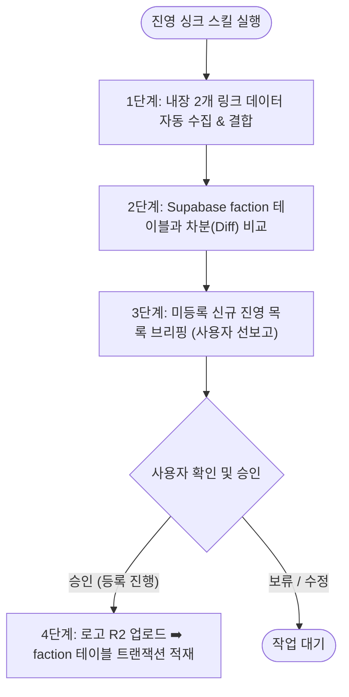

# 진영 자동 동기화 스킬 (register-faction / sync-faction)

이 스킬은 젠레스 존 제로(ZZZ)의 진영 데이터베이스(`faction`)를 공식 최신 상태로 유지하기 위한 **진영 자동 싱크(Sync) 스킬**입니다.  
사용자가 매번 링크나 ID를 찾아서 입력할 필요 없이, **공식 소스 2개 링크를 스킬 내부에 상시 내장**하여 DB와 차분(Diff)을 비교하고, **사용자의 사전 승인(Confirmation)을 받은 후에만 안전하게 등록**합니다.

---

## 1. 내장 공식 원천 링크 (Hardcoded Sources)

스킬 실행 시 아래 2개 링크의 데이터를 자동으로 동시 수집하여 결합합니다:

1. **호요랩 위키 진영 목록 (HoYoLAB Wiki Aggregate 22)**:
   - URL: `https://wiki.hoyolab.com/pc/zzz/aggregate/22`
   - API: `https://sg-wiki-api.hoyolab.com/hoyowiki/zzz/wapi/get_entry_page_list`
   - 헤더: `x-rpc-wiki_app: zzz`, `x-rpc-language: ko-kr` 및 `en-us`
   - 수집 항목: 진영 한글명(`nameKo`), 영문명(`nameEn`), 호요위키 ID(`hoyowikiId`), 로고 엠블럼 원본 URL(`icon_url`)
2. **호요버스 공식 게임 Camp API (공식 SSOT ID)**:
   - API: `https://sg-public-api-static.hoyoverse.com/content_v2_user/app/3e9196a4b9274bd7/getContentList?iChanId=286&iPageSize=50&iPage={page}&sLangKey=ko-kr`
   - 수집 항목: **호요버스 공식 게임 Camp 고유 ID (`id`, bigint)**

---

## 2. 실행 워크플로우 (4-Step Pipeline)



---

### [1단계] 공식 소스 데이터 조회 및 자동 매핑

1. 호요랩 위키의 한국어/영어 목록을 페이지 끝까지 조회하여 `nameKo`, `nameEn`, `entry_page_id`, `icon_url`을 확보합니다. 응답에 페이지 수가 없거나 목록 완료 여부를 판단할 수 없으면 전체 목록으로 간주하지 않습니다.
2. 호요버스 공식 Camp API(`iChanId=286`)도 모든 페이지를 조회하여 공식 `iInfoId`를 확보합니다. HTTP 오류, 비정상 `retcode`, 필수 필드 누락 시 동기화를 중단합니다.
3. 두 응답의 필수 값을 대조합니다. 한글명과 영문명을 함께 비교하고, 이름이 중복되거나 어느 한쪽과 매칭되지 않는 항목은 자동 등록하지 않고 사용자 확인 대상으로 남깁니다.
4. 진영 한글명(`nameKo`)을 매핑 후보로 사용하고 공식 Camp ID를 기본 키로 확인하여 완전한 메타데이터를 만듭니다:
   - `id`: 공식 Camp ID (예: `165576`) ➡️ **에이전트 외래키 완벽 보장**
   - `nameKo`: 공식 한글명 (예: `'플린트 공방'`)
   - `nameEn`: 공식 영문명 (예: `'Flint Workshop'`)
   - `hoyowikiId`: 호요위키 번호 (예: `1187`)
   - `logoUrl`: 호요랩 위키 투명 로고 엠블럼 URL

---

### [2단계] Supabase DB 대조 및 차분(Diff) 탐색

Supabase `faction` 테이블의 전체 목록을 조회하여:
- **신규 진영**: 공식 소스에는 존재하나 우리 DB에 `id` 또는 `nameKo`가 없는 항목 식별 (예: `165576` 플린트 공방)
- **보완 항목**: 이미 등록되어 있으나 `imageId`가 `null`이거나 `hoyowikiId`가 누락된 항목 식별

같은 `nameKo`가 다른 ID로 이미 있거나 동일 ID에 다른 진영명이 연결된 경우에는 자동 삽입·갱신하지 말고 충돌로 보고합니다. `nameKo`가 고유하다고 가정하지 않습니다.

---

### [3단계] 사용자 사전 보고 (User Approval Required)

**절대로 DB에 임의로 먼저 쓰지 않고**, 발견된 신규/보완 진영 목록을 사용자에게 마크다운 표로 먼저 브리핑합니다:

```markdown
### 📢 진영 동기화 사전 브리핑

공식 소스와 DB를 대조한 결과, 총 **1개**의 신규 진영이 감지되었습니다:

| 진영 ID (공식) | 한글명 | 영문명 | 호요위키 ID | 이미지 원본 URL | 등록 상태 |
| :---: | :--- | :--- | :---: | :--- | :---: |
| **`165576`** | 플린트 공방 | Flint Workshop | 1187 | `https://...` | ⚠️ **DB 미등록 (신규)** |

위 데이터를 DB에 등록하고 로고 이미지를 R2에 업로드할까요? 승인해 주시면 즉시 반영하겠습니다.
```

---

### [4단계] 사용자 승인 시 적재 실행

사용자가 "승인", "진행해줘" 등의 피드백을 전달하면 최종 작업을 수행합니다:

명시적 승인 전에는 이미지 업로드나 DB 쓰기를 하지 않습니다. 승인 화면에는 ID, 한글명, 영문명, 호요위키 ID, 이미지 원본 URL, 신규/보완 구분을 모두 포함합니다.

1. **로고 이미지 R2 업로드**:
   ```bash
   npx tsx .cursor/skills/upload-r2-image/scripts/upload.ts \
     --url "{logoUrl}" \
     --path "factions"
   ```
   성공한 CDN URL과 R2 key를 기록합니다. 같은 CDN URL이 `image` 테이블에 있으면 해당 `image.id`를 재사용합니다. 실패 후 재시도할 때 이미 성공한 URL은 다시 업로드하지 않습니다.
2. **이미지 및 진영을 한 DB 트랜잭션으로 등록**:

   `image.type`은 공통 등록 규칙의 enum 조회로 검증하며, 진영 로고에는 운영 표준 값인 `faction_logo`를 사용합니다.

   ```sql
   BEGIN;

   -- 기존 CDN URL은 기존 image.id를 재사용하고, 신규 URL은 새 UUID를 사용합니다.
   INSERT INTO public.image (id, src, type, description)
   VALUES ('{imageId}', '{r2_cdn_url}', 'faction_logo', '{nameKo} 진영 로고')
   ON CONFLICT (id) DO UPDATE SET
     src = EXCLUDED.src,
     type = EXCLUDED.type,
     description = EXCLUDED.description;

   INSERT INTO public.faction (id, "nameKo", "nameEn", "hoyowikiId", "imageId")
   VALUES ({id}, '{nameKo}', '{nameEn}', {hoyowikiId}, '{imageId}')
   ON CONFLICT (id) DO UPDATE SET
     "nameKo" = EXCLUDED."nameKo",
     "nameEn" = EXCLUDED."nameEn",
     "hoyowikiId" = COALESCE(EXCLUDED."hoyowikiId", faction."hoyowikiId"),
     "imageId" = COALESCE(EXCLUDED."imageId", faction."imageId");

   COMMIT;
   ```

   실패 시 DB 트랜잭션 전체를 롤백합니다. 이미 업로드된 R2 URL은 재사용하고 새 이미지를 다시 올리지 않습니다.

---

## 3. 사후 검증 쿼리

```sql
SELECT f.id, f."nameKo", f."nameEn", f."hoyowikiId", i.src as logo_url
FROM public.faction f
LEFT JOIN public.image i ON i.id = f."imageId"
WHERE f.id = {id};
```

---

## 4. 관련 규격 문서

| 문서명 | 경로 | 설명 |
| :--- | :--- | :--- |
| **진영 등록 규칙** | [faction-registration.md](../../rules/operations/faction-registration.md) | 진영 마스터 및 운영 상세 규격 |
| **공통 등록 안전 수칙** | [roster-auto-registration.md](../../rules/operations/roster-auto-registration.md) | 승인, 트랜잭션, 재시도 및 입력 검증 |
| **호요버스 공식 API** | [hoyoverse-character-api.md](../../rules/operations/hoyoverse-character-api.md) | 호요버스 공식 API 및 Camp ID 체계 |
| **에이전트 등록 스킬** | [register-agent](../register-agent/SKILL.md) | 진영 등록 후속 에이전트 등록 스킬 |
| **R2 업로드 스킬** | [upload-r2-image](../../../.cursor/skills/upload-r2-image/SKILL.md) | 로고 R2 스토리지 업로드 도구 |
