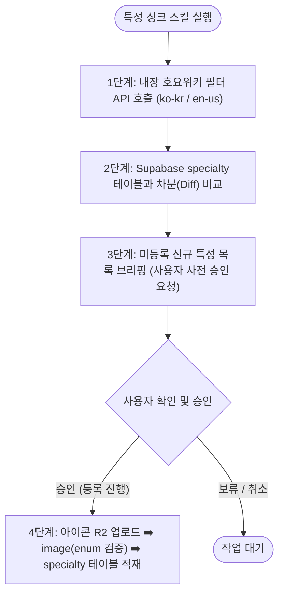

# 특성 자동 동기화 스킬 (register-specialty / sync-specialty)

이 스킬은 젠레스 존 제로(ZZZ)의 캐릭터 특성(Specialty, 역할군) 데이터베이스(`specialty`)를 공식 최신 상태로 유지하기 위한 **특성 자동 싱크(Sync) 스킬**입니다.  
사용자가 매번 링크나 ID를 찾을 필요 없이, **공식 호요랩 위키 필터 API 링크를 내장**하여 DB와 차분(Diff)을 비교하고, **사용자의 사전 승인(Confirmation)을 받은 후에만 안전하게 등록**합니다.

---

## 1. 내장 공식 원천 링크 (Hardcoded Sources)

[공통 등록 안전 수칙](../../../wiki/operations/roster-auto-registration.md)을 적용합니다. API 실패나 미완료 응답을 빈 목록으로 취급하지 말고 동기화를 중단합니다.

스킬 실행 시 아래 공식 엔드포인트를 호출하여 한국어/영어 특성 메타데이터 및 공식 아이콘 URL을 수집합니다:

- **한국어 (ko-kr)**:
  - URL: `https://sg-wiki-api.hoyolab.com/hoyowiki/zzz/wapi/get_menu_filters?menu_id=8`
  - 헤더: `x-rpc-wiki_app: zzz`, `x-rpc-language: ko-kr`
  - 추출 대상: `data.filters` 중 `key === "agent_specialties"`의 `values` 배열
  - 수집 항목: 한글명(`value`), 공식 영문 enum(`enum_string`), 아이콘 원본 URL(`icon`)
- **영어 (en-us)**:
  - URL: `https://sg-wiki-api.hoyolab.com/hoyowiki/zzz/wapi/get_menu_filters?menu_id=8`
  - 헤더: `x-rpc-wiki_app: zzz`, `x-rpc-language: en-us`
  - 수집 항목: 공식 영문 표기명(`value`, 예: `Armorer`, `Rupture` 등)

---

## 2. 실행 워크플로우 (4-Step Pipeline)



---

### [1단계] 공식 소스 데이터 수집 및 자동 매핑

1. 한국어/영어 필터 API 응답에서 HTTP 성공, 정상 응답 코드, `data.filters`와 `agent_specialties.values` 구조를 확인합니다.
2. 두 언어 목록은 공통 `enum_string`으로 결합합니다. 누락·중복 키가 있으면 동기화를 중단합니다. `id`는 보고용 참고값이며 DB `specialty.id`로 저장하지 않습니다.
3. 한국어명(`nameKo`), 영문 표시명(`nameEn`), 아이콘 URL(`icon_url`)을 구성합니다:
   - 예: `id: 148` ➡️ `nameKo: '단조'`, `nameEn: 'Armorer'`, `icon_url: 'https://act-webstatic.hoyoverse.com/.../442942c0c06a188b19ab3fa761685018_3730761288319589198.png'`

---

### [2단계] Supabase DB 대조 및 차분(Diff) 탐색

Supabase `specialty` 테이블의 전체 목록을 조회하여:
- **신규 특성**: 공식 소스에는 존재하나 DB `specialty` 테이블에 `nameKo`가 없는 항목 식별 (예: `'단조'`)
- **보완 항목**: 이미 등록되어 있으나 `imageId`가 누락되었거나 영문명이 다른 항목 식별

기존 항목은 `nameKo`와 `nameEn`을 함께 비교합니다. 같은 한글명이 여러 행에 있으면 자동 갱신하지 말고 충돌로 보고합니다. 정확히 한 행이 있으면 기존 UUID를 보존해 갱신합니다.

---

### [3단계] 사용자 사전 보고 (User Approval Required)

**절대로 DB에 임의로 먼저 쓰지 않고**, 감지된 신규/보완 특성 목록을 사용자에게 마크다운 표로 먼저 브리핑합니다:

```markdown
### 📢 특성 동기화 사전 브리핑

공식 소스와 DB를 대조한 결과, 총 **1개**의 신규 특성이 감지되었습니다:

| 특성 한글명 | 영문명 | `enum_string` | Filter ID | 아이콘 원본 URL | 변경 대상 특성 ID |
| :---: | :---: | :---: | :---: | :--- | :---: |
| **단조** | Armorer | `{enum_string}` | 148 | `https://...` | 신규 (UUID 발급 예정) |

위 데이터를 DB에 등록하고 아이콘 이미지를 R2에 업로드할까요? 승인해 주시면 즉시 반영하겠습니다.
```

---

### [4단계] 사용자 승인 시 적재 실행

승인 화면에는 신규/보완 구분, `enum_string`, 한글·영문명, Filter ID, 이미지 원본 URL, 변경 대상 행 UUID를 포함합니다. 명시적 승인 전에는 R2 업로드나 DB 쓰기를 하지 않습니다.

1. **아이콘 이미지 R2 업로드**:
   - `.cursor/skills/upload-r2-image/SKILL.md`와 Cursor Cloud Secrets를 사용합니다. 프로젝트 `.env`를 사용하지 않습니다.
   - 경로 prefix는 `specialty`로 지정하고 성공한 CDN URL과 R2 key를 기록합니다.
   - 기존 행에 정상 이미지가 연결되어 있고 교체 승인이 없으면 재사용합니다. DB에 동일 CDN URL의 `image` 행이 있으면 그 ID를 재사용합니다.
2. **이미지 유형 확인**:
   `image.type`의 허용 enum을 공통 등록 규칙의 조회 쿼리로 확인합니다. `'Specialty'`를 임의로 사용하지 않습니다. 특성 아이콘에 맞는 허용값이 없으면 DB 쓰기를 중단하고 스키마 보완이 필요하다고 보고합니다.
3. **이미지와 `specialty` 행을 한 트랜잭션으로 적재**:

   기존 CDN URL이 이미 등록되어 있으면 이미지 `INSERT`를 생략하고 기존 `image.id`를 사용합니다. 아래 트랜잭션에서 기존 행 갱신 또는 신규 행 삽입 중 하나만 실행합니다.

   ```sql
   BEGIN;

   INSERT INTO public.image (id, src, type, description)
   VALUES ('{imageId}', '{r2_cdn_url}', '{verified_image_type}', '{nameKo} 특성 아이콘')
   ON CONFLICT (id) DO UPDATE SET
     src = EXCLUDED.src,
     type = EXCLUDED.type,
     description = EXCLUDED.description;

   -- 기존 행 보완: 정확히 한 행이 확인된 경우 실행합니다.
   UPDATE public.specialty
   SET "nameKo" = '{nameKo}', "nameEn" = '{nameEn}', "imageId" = '{imageId}'
   WHERE id = '{existingSpecialtyId}';

   -- 신규 행 등록: 위 UPDATE 대신 실행하며, 동일 nameKo가 없을 때만 삽입합니다.
   -- INSERT INTO public.specialty (id, "nameKo", "nameEn", "imageId")
   -- SELECT gen_random_uuid(), '{nameKo}', '{nameEn}', '{imageId}'
   -- WHERE NOT EXISTS (
   --   SELECT 1 FROM public.specialty WHERE "nameKo" = '{nameKo}'
   -- );

   -- 변경된 행이 정확히 1개면 COMMIT, 아니면 ROLLBACK합니다.
   -- 실행 예: COMMIT;
   -- 실패·행 수 불일치 예: ROLLBACK;
   ```

   변경된 행이 정확히 1개인지 확인하기 전에는 커밋하지 않습니다. 0행·중복 후보·DB 오류면 `ROLLBACK`합니다. DB 실패 시 R2 URL을 기록해 재사용하고 다시 업로드하지 않습니다.

---

## 3. 사후 검증 쿼리

```sql
SELECT s.id, s."nameKo", s."nameEn", s."imageId", i.src as icon_url
FROM public.specialty s
LEFT JOIN public.image i ON i.id = s."imageId"
WHERE s."nameKo" = '{nameKo}';
```

검증 결과가 정확히 한 행이어야 합니다. `imageId`가 의도한 행을 가리키고 `icon_url`이 승인된 CDN URL과 일치하는지 확인합니다.

---

## 4. 관련 규격 문서

| 문서명 | 경로 | 설명 |
| :--- | :--- | :--- |
| **밴픽 시스템** | [banpick-system.md](../../../wiki/banpick-system.md) | 캐릭터 특성 및 밴픽 포지션(딜러/서포터) 정의 |
| **공통 등록 안전 수칙** | [roster-auto-registration.md](../../../wiki/operations/roster-auto-registration.md) | 승인, 트랜잭션, 재시도 및 입력 검증 |
| **진영 등록 스킬** | [register-faction](../register-faction/SKILL.md) | 선행 진영 등록 자동 싱크 스킬 |
| **에이전트 등록 스킬** | [register-agent](../register-agent/SKILL.md) | 캐릭터 등록 시 특성(specialtyId) 외래키 연결 |
| **R2 업로드 스킬** | [upload-r2-image](../../../.cursor/skills/upload-r2-image/SKILL.md) | 공개 CDN URL을 반환하는 이미지 업로드 절차 |
