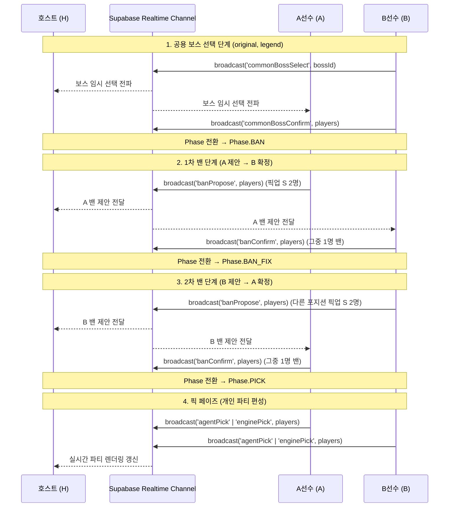

# renew 실시간 통신 구조

`apps/renew`는 Supabase의 **Realtime Channel Broadcast** 기능을 활용하여 호스트와 선수(A/B) 간의 상태를 초저지연으로 동기화합니다.

## 경기 진행 페이즈 (Phase State Machine)

경기는 `Phase` 열거형에 따라 단계적으로 진행됩니다.

```mermaid
graph TD
    A[COMMON_BOSS_SELECT<br/>B선수가 2R 공용 보스 선택] -->|B 보스 확정| B[BAN<br/>1차 밴: A가 2명 제안 → B가 1명 확정]
    B -->|B 밴 확정| C[BAN_FIX<br/>2차 밴: B가 다른 포지션 2명 제안 → A가 1명 확정]
    C -->|A 밴 확정| D[PICK<br/>1R/2R 에이전트·엔진 편성 및 개인 보스 선택]
    
    style A fill:#1c2331,stroke:#00f0ff,stroke-width:2px
    style B fill:#1c2331,stroke:#ffd215,stroke-width:2px
    style C fill:#1c2331,stroke:#ffd215,stroke-width:2px
    style D fill:#1c2331,stroke:#ffd215,stroke-width:2px
```

> [!NOTE]
> **공허사냥꾼 (`unlimited`) 모드 특례**:  
> `공허사냥꾼` 경기는 보스 선택과 캐릭터 밴 페이즈가 모두 생략되며, 방 입장 즉시 `Phase.PICK` 상태로 시작합니다.

---

## 브로드캐스트 이벤트 목록 (`BroadcastEvent`)

| 이벤트명 | 페이로드 타입 | 설명 |
| :--- | :--- | :--- |
| `commonBossSelect` | `string (bossId)` | B선수가 공용 무대 보스를 임시 선택했을 때 전파 |
| `commonBossConfirm`| `Record<PlayerRole, Player>` | 공용 무대 보스 최종 확정 시 전파 |
| `banSelect` | `Array<number \| null>` | 밴 후보 캐릭터 임시 클릭 정보 전파 |
| `banPropose` | `Record<PlayerRole, Player>` | 2명의 밴 후보 캐릭터 제안 완료 시 전파 |
| `banFix` | `Array<number \| null>` | 제안된 2명 중 1명 선택 정보 전파 |
| `banConfirm` | `Record<PlayerRole, Player>` | 최종 1명 밴 확정 시 전파 (다음 페이즈로 이동) |
| `bossSelect` | `Record<PlayerRole, Player>` | 1R 또는 2R 개인 보스 선택 시 전파 |
| `agentPick` | `Record<PlayerRole, Player>` | 1R/2R 에이전트 슬롯 및 돌파 수치 변경 시 전파 |
| `enginePick` | `Record<PlayerRole, Player>` | 1R/2R W-엔진 슬롯 및 돌파 수치 변경 시 전파 |
| `score` | `Record<PlayerRole, Player>` | 라운드 점수 입력 시 전파 |
| `time` | `Record<PlayerRole, Player>` | 라운드 소요 시간 입력 시 전파 |
| `matchType` | `Match` | 경기 타입 변경 시 전파 |

---

## 실시간 동기화 시퀀스 다이어그램

## 데이터 영속성 (Persistence)

실시간 브로드캐스트와 동시에, 상태 변경 사항은 Supabase의 `match` 및 `play` 테이블에 업데이트되어 중간에 페이지를 새로고침하더라도 경기 상태가 완벽하게 복원됩니다.
