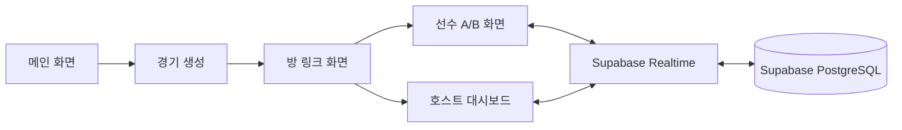

# 시스템 아키텍처

`apps/renew`는 zzz-picker의 메인 경기 운영 앱입니다. Remix 파일 기반 라우팅, React, Tailwind CSS v4를 사용하고, 경기 상태와 마스터 데이터는 Supabase를 통해 읽고 씁니다.

## 주요 경계

| 영역 | 위치 | 책임 |
| :--- | :--- | :--- |
| 메인 UI·도메인 로직 | `apps/renew/app` | 라우트, 경기 화면, 상태 훅, DB 접근 |
| Supabase 클라이언트 | `packages/supabase` | 앱이 공유하는 Supabase 연결 |
| R2 유틸리티 | `packages/r2-storage` | 이미지 객체 업로드와 탐색 기능 |
| 공유 UI | `packages/zpds`, `packages/components`, `packages/ui` | 앱과 Storybook에서 재사용하는 컴포넌트 |
| 컴파일된 설계 지식 | `wiki/` | 규칙, 데이터 모델, 구현 안내 및 운영 문서 |

## 페이지 지도

| 경로 | 파일 | 역할 |
| :--- | :--- | :--- |
| `/` | `apps/renew/app/routes/_index.tsx` | 메인 화면, 경기 모드 선택, 방 개설 |
| `/:roomId` | `apps/renew/app/routes/$roomId.tsx` | 역할별 선수 화면 또는 호스트 경기 대시보드 |
| `/room/:id` | `apps/renew/app/routes/room.$id.tsx` | 방 접속 링크 및 참가자 역할 안내 |
| `/bracket` | `apps/renew/app/routes/bracket.tsx` | 8강 토너먼트 대진표. 대진표 상태는 브라우저 `localStorage`에 저장하며 경기 생성은 기존 매치/플레이 DB 경로를 사용 |
| `/calc` | `apps/renew/app/routes/calc.tsx` | 점수 계산기 |
| `/cost` | `apps/renew/app/routes/cost.tsx` | 에이전트 및 W-엔진 코스트 기준표 |
| `/wallpaper` | `apps/renew/app/routes/wallpaper.tsx` | 월페이퍼 갤러리 |
| `/loading` | `apps/renew/app/routes/loading.tsx` | 로딩 화면 확인용 |

## 일반 경기 흐름

`/bracket`은 일반 경기 참가용 UI와 분리된 대진 관리 화면입니다. 대진표 전체 상태는 로컬 브라우저에 보관하고, 카드에서 경기를 만들면 기존 `match` 및 `play` 레코드를 생성한 다음 해당 경기 로비를 새 탭으로 엽니다.

## 세부 문서

- [앱 개요와 디렉터리](apps/renew/overview.md)
- [라우트별 상세 동작](apps/renew/routes.md)
- [핵심 컴포넌트](apps/renew/components.md)
- [Realtime 상태와 이벤트](apps/renew/realtime.md)
- [공유 패키지](packages/index.md)
