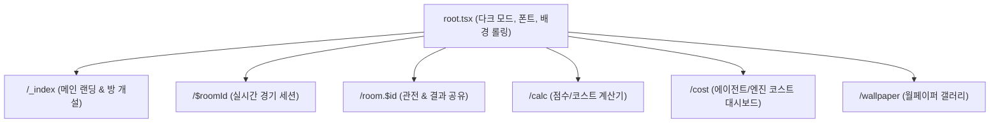
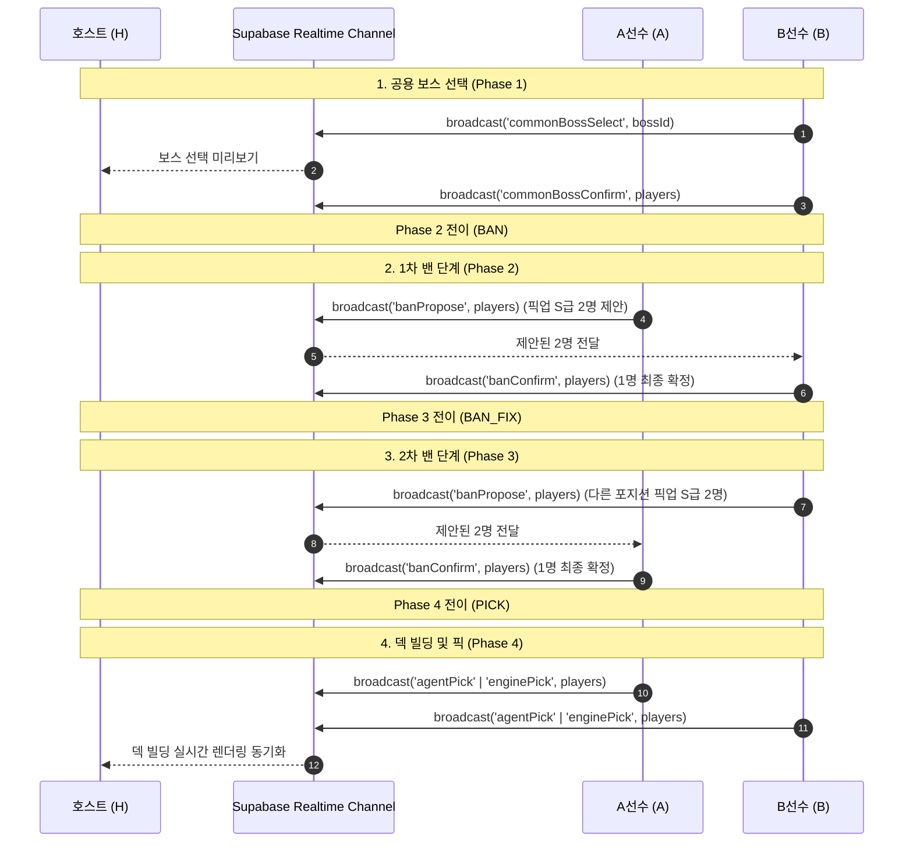

# 시스템 아키텍처 및 구현 명세 (Architecture)

`@zzz-picker/renew`(`apps/renew`)는 zzz-picker 서비스의 메인 애플리케이션이자 단일 진실 공급원(SSOT)입니다. Remix 기반의 풀스택 웹 프레임워크와 Tailwind CSS v4, 그리고 Supabase Realtime Broadcast를 활용하여 호스트와 선수 간의 경기 상태를 초저지연으로 동기화합니다.

---

## 1. 기술 스택 요약

| 분류 | 기술 | 버전 및 상세 역할 |
| :--- | :--- | :--- |
| **프레임워크** | Remix (Vite) | `^2.17.5`, SSR/SPA 하이브리드 라우팅 및 번들러 |
| **스타일링** | Tailwind CSS v4 | `@tailwindcss/vite`, `^4.1.14`, `@theme inline` 기반 ZZZ 테마 토큰 |
| **상태 관리** | React Context & Hooks | React 19, `StoreContext`(마스터 캐시), `MatchContext`(실시간 세션) |
| **백엔드/소켓** | Supabase | PostgreSQL 데이터베이스 및 Realtime Channel Broadcast |
| **함수형 유틸** | `@fxts/core` | `^1.23.0`, 파이프라인(`pipe`), 이터러블 연산, 코스트/점수 계산 |
| **모션/트랜지션** | Chrome View Transition | `/wallpaper` 라우트의 카드 줌 모션 및 슬라이딩 패널 트랜지션 |

---

## 2. 라우트 명세 (Routes)

`apps/renew/app/routes` 하위의 파일 기반 라우팅 구조입니다.



| 라우트 경로 | 컴포넌트 및 파일 | 주요 기능 및 역할 |
| :--- | :--- | :--- |
| `/` | `_index.tsx` | 메인 홈, 게임 모드 선택 카드(강습전/모의전투), 방 개설 다이얼로그(`CreateRoom`) |
| `/:roomId` | `$roomId.tsx` | **실시간 경기 핵심 라우트**. URL 쿼리(`role=A`, `B`, `host`)에 따라 플레이어 화면(`PlayGround`) 또는 호스트 대시보드(`HostDashboard`)를 동적으로 분기 마운트 |
| `/room/:id` | `room.$id.tsx` | 종료된 경기 결과 및 현재 진행 상태를 외부 관전자에게 공유하는 뷰 |
| `/calc` | `calc.tsx` | 보너스 점수 산출 공식 및 실시간 파티 조합 계산 유틸리티 |
| `/cost` | `cost.tsx` | 전 에이전트 및 W-엔진의 돌파별 코스트 표를 한눈에 열람하는 대시보드 |
| `/wallpaper` | `wallpaper.tsx` | ZZZ 공식 일러스트 갤러리 (가로 스크롤 스냅 + View Transition 연동) |

---

## 3. 핵심 컴포넌트 아키텍처

### 3.1 플레이어 인터페이스 (`PlayGround`) - 모바일 뷰포트 최적화 (`max-w-lg`)
선수(A, B)가 모바일 또는 태블릿에서 한 손으로 조작할 수 있도록 하단 플로팅 컨트롤과 카드 기반 그리드를 제공합니다.

- **`Boss`**: 공용 무대 보스 및 개인 희망 보스 선택 카드 그리드.
- **`Ban`**: 1차/2차 제안 밴을 위한 3열 캐릭터 그리드.
- **`BanFix`**: 풀스크린 백드롭 블러 오버레이에서 상대가 제안한 2명 중 1명을 원터치로 확정 밴.
- **`Pick`**: 상단 1R/2R 탭, 3인 에이전트 슬롯, W-엔진 슬롯, 하단 고정 잔여 코스트 플로팅 알약 바(`Cost`).
- **`RateController`**: 화면 최하단에 부착되어 원형 +/- 버튼으로 에이전트(0~6돌) 및 엔진(1~5돌) 돌파 단계를 실시간 조작.

### 3.2 호스트 대시보드 (`HostDashboard`) - 데스크톱 3단 분할 그리드
경기 진행자(호스트)가 대형 화면에서 전체 경기 상황을 조망하고 실시간으로 스코어를 채점합니다.

```text
┌─────────────────┬─────────────────┬─────────────────────────────────────┐
│ [좌측: 규칙/제어] │ [중앙: 밴/보스]  │ [우측: 메인 경기판 & 결산]          │
│                 │                 │                                     │
│  ← 홈 이동      │  경기 타입 배지  │  선수 닉네임 (A vs B) & 접속 칩    │
│  특수 룰 텍스트  │  공용 보스 슬롯  │  ─────────────────────────────────  │
│                 │  허용 캐릭터     │  1 Round: A파티 ── VS ── B파티     │
│                 │  밴 결과 현황    │  2 Round: A파티 ── VS ── B파티     │
│                 │  (A 밴 → B 밴)  │  (타이머, 점수, 에이전트/엔진 슬롯) │
│                 │  캐릭터 일러스트 │  ─────────────────────────────────  │
│                 │                 │  [파티보기 ↔ 결산하기 슬라이딩 토글] │
└─────────────────┴─────────────────┴─────────────────────────────────────┘
```

- **좌우 대칭 구도**: A선수는 왼쪽 정렬, B선수는 `flex-row-reverse` 우측 정렬로 대전 분위기를 극대화.
- **슬라이딩 결산 전환**: 우측 영역의 탭 토글을 통해 실시간 파티 덱 보기와 라운드 점수/시간 입력 결산판(`Result`) 간을 부드러운 CSS 슬라이드로 전환.

---

## 4. 실시간 브로드캐스트 이벤트 시퀀스

Supabase Realtime Channel을 통한 메시지 전파 흐름입니다.



### 4.1 데이터 영속성 (Persistence)
- 브로드캐스트 이벤트가 발생함과 동시에 Supabase DB의 `match` 및 `play` 레코드가 비동기로 업데이트됩니다.
- 브라우저를 새로고침하거나 접속이 일시 끊겨도 DB로부터 최신 상태를 페치하여 100% 무손실 복구됩니다.

---

## 5. 연관 위키 문서

- [경기 규칙 및 점수 체계 (game-rules.md)](./game-rules.md)
- [밴픽 및 코스트 시스템 (banpick-system.md)](./banpick-system.md)
- [데이터베이스 스키마 명세 (database.md)](./database.md)
- [디자인 시스템 가이드 (design-system.md)](./design-system.md)
- [위키 인덱스로 돌아가기 (index.md)](./index.md)
