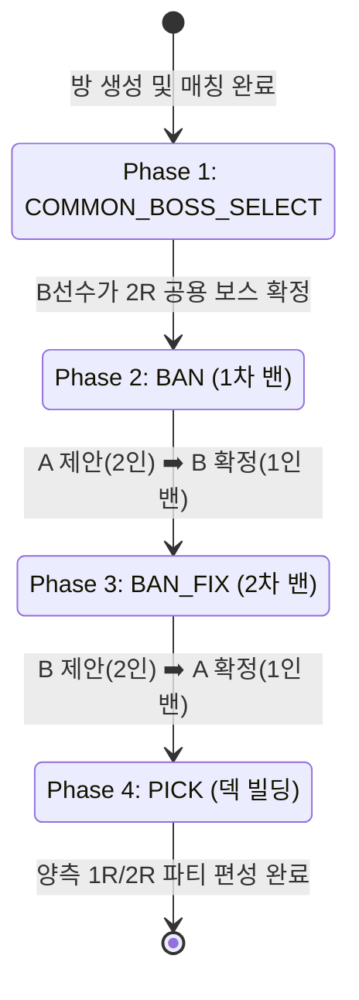

# 밴픽 및 코스트 시스템 (Ban & Pick System)

`zzz-picker`의 경기 핵심은 상대의 주력 조합을 차단하고 24 코스트 제한 안에서 최고의 파티 시너지를 구축하는 **4단계 밴픽 상태 머신**과 **개별 코스트 책정제**입니다.

---

## 1. 4단계 Phase 진행 절차

경기 모드(`정식 로프꾼`, `레전드 로프꾼`)에 따라 다음 4단계 상태 머신을 순차적으로 통과합니다.  
*(단, `공허사냥꾼` 모드는 보스 선택과 밴 페이즈를 생략하고 즉시 Phase 4로 진입합니다.)*



### Phase 1: 공용 보스 선택 (`COMMON_BOSS_SELECT`)
- **행동 주체**: **B선수**
- **역할**: 이번 매치에서 양 선수가 2라운드에 공통으로 격돌할 '공용 보스' 1종을 선택하고 확정합니다.

### Phase 2: 1차 밴 (`BAN`)
1. **A선수 제안**: A선수가 **S급 픽업 에이전트 2명**을 밴 후보(`proposeBan`)로 제안합니다.
   - 단, 방 설정에서 지정된 **보호 캐릭터(Allow Agent)**나 미출시 티저 캐릭터는 제안할 수 없습니다.
2. **B선수 확정**: B선수가 A선수가 제안한 2명 중 **1명을 최종 밴(`selectBan`)**으로 확정합니다.

### Phase 3: 2차 밴 (`BAN_FIX`)
1. **B선수 제안**: B선수가 **1차 밴된 캐릭터와 다른 포지션**의 **S급 픽업 에이전트 2명**을 후보로 제안합니다.
   - **포지션 교차 룰**:
     - 딜러 계열: **강공, 명파, 이상, 단조**
     - 서포터 계열: **지원, 격파, 방어**
     - *예: 1차 밴이 '강공(딜러)'이었다면, 2차 밴 제안은 반드시 '서포터' 군에서만 선택 가능.*
2. **A선수 확정**: A선수가 B선수의 제안 2명 중 **1명을 최종 밴**으로 확정합니다.
3. 이로써 양측에 각각 1명씩 총 2명의 픽업 S급 캐릭터가 이번 경기 출전 금지 목록에 오릅니다.

### Phase 4: 픽 페이즈 (`PICK`)
- 각 선수는 1R와 2R에 출전할 독립된 2개의 파티를 구성합니다.
  - **파티당 슬롯**: 3명의 에이전트 슬롯 + 각 에이전트 전용/공용 W-엔진 슬롯.
  - **중복 출전 제한**: 1라운드에 출전한 에이전트와 엔진은 2라운드에 재출전 불가.
  - **돌파 조절**: 에이전트 0~6돌, W-엔진 1~5돌(재련) 설정.

---

## 2. 코스트 시스템 (개별 코스트 책정제)

zzz-picker는 일률적인 등급별 고정 코스트 대신, **캐릭터와 W-엔진의 실제 게임 내 위상과 밸런스에 맞춰 개별적으로 책정된 코스트 단일 진실 공급원(SSOT)**을 운용합니다.

### 2.1 에이전트 5대 코스트 표준 프리셋

| 프리셋 명칭 | 0돌 ~ 6돌 코스트 배열 | 특징 및 대표 캐릭터 |
| :--- | :--- | :--- |
| **Preset 1 (0.5 단위 픽업)** | `[0, 0.5, 1.0, 1.5, 2.0, 2.5, 3.0]` | 0돌 무료, 1돌파당 +0.5코스트 *(주연, 청의, 카이사르, 야나기, 라이터 등)* |
| **Preset 2 (1.0 단위 픽업)** | `[0, 1.0, 2.0, 3.0, 4.0, 5.0, 6.0]` | 0돌 무료, 1돌파당 +1.0코스트 *(엘렌, 제인, 버니스, 하루마사 등)* |
| **Preset 3 (1코 시작 강력형)**| `[1.0, 2.0, 3.0, 4.0, 5.0, 6.0, 7.0]` | 0돌부터 1코스트, 1돌파당 +1.0코스트 *(호시미 미야비 등)* |
| **Preset 4 (4돌 1코 상시형)** | `[0, 0, 0, 0, 1.0, 1.0, 1.0]` | 0~3돌 무료, 4돌부터 1.0코스트 *(11호, 리카온, 네코마타 등 상시 S급)* |
| **Preset 5 (0코스트 무료형)** | `[0, 0, 0, 0, 0, 0, 0]` | 전 돌파 무료 (0 코스트) *(콜레다 및 A급 에이전트 전원)* |

### 2.2 W-엔진 3대 코스트 표준 프리셋

| 프리셋 명칭 | 1돌 ~ 5돌 코스트 배열 | 적용 기준 및 예시 |
| :--- | :--- | :--- |
| **S급 전용 무기** | `[1.0, 1.5, 2.0, 2.5, 3.0]` | 기본 1.0코스트, 재련당 +0.5코스트 *(전용 S급 무기)* |
| **S급 상시 무기** | `[0.0, 0.0, 0.0, 1.0, 1.0]` | 1~3돌 무료, 4~5돌 1.0코스트 *(상시 S급 무기)* |
| **A급 / B급 무기** | `[0.0, 0.0, 0.0, 0.0, 0.0]` | 전 돌파 무료 (0 코스트) |

---

## 3. 런타임 덱 빌딩 및 데이터 구조 (`apps/renew`)

### 3.1 슬롯 배열 구조
선수의 파티 선택 상태는 1R와 2R의 2차원 배열로 관리됩니다:
```typescript
type AgentSlot = { id: number; rate: number }   // rate: 0~6
type EngineSlot = { id: string; rate: number }  // rate: 1~5

player.agentSlot  // [ [A1, A2, A3], [B1, B2, B3] ]
player.engineSlot // [ [E1, E2, E3], [E1, E2, E3] ]
```

### 3.2 실시간 코스트 합산 훅 (`useCost`)
- `apps/renew/app/hooks/index.ts`의 `useCost(round)`는 함수형 프로그래밍 라이브러리(`@fxts/core`) 파이프라인을 사용하여 슬롯에 배치된 에이전트와 엔진의 DB 코스트 레코드를 실시간 색인하고 총합을 계산합니다.
- 총합이 24 Cost 이하일 경우 잔여 코스트를 초록색 뱃지로 표시하며, 초과 시 즉시 빨간색 경고(`--color-tertiary: #ff4500`) 배지를 띄워 페널티 위험을 시각화합니다.

---

## 4. 에이전트와 W-엔진 분류

### 에이전트

| 구분 | 밴픽 기준 | 코스트 기준 |
| :--- | :--- | :--- |
| S급 픽업 | 보호 설정이 없고 티저가 아니면 밴 후보가 될 수 있음 | 캐릭터별 `agentCost` 데이터 적용 |
| S급 상시 | 밴 후보가 아님 | 캐릭터별 `agentCost` 데이터 적용 |
| A급 | 밴 후보가 아님 | 기본 프리셋은 무료, 최종값은 `agentCost` 기준 |

모든 에이전트의 돌파 단계는 0~6입니다. 밴 단계에서는 특성을 딜러와 서포터로 묶습니다. 딜러는 강공·명파·이상·단조, 서포터는 지원·격파·방어이며 2차 밴 제안은 1차 밴과 반대 포지션에서 고릅니다.

### W-엔진

W-엔진 등급은 S/A/B이고 재련 단계는 1~5입니다. 특정 에이전트 전용 엔진은 `exclusiveAgentId`로 연결됩니다. 등급별 배열은 등록 시 참고하는 프리셋이며 실제 경기 계산은 엔진별 `engineCost` 행을 사용합니다.

---

## 5. 연관 위키 문서

- [경기 규칙 및 점수 체계 (game-rules.md)](./game-rules.md)
- [시스템 아키텍처 및 라우트 (architecture.md)](./architecture.md)
- [데이터베이스 스키마 명세 (database.md)](./database.md)
- [위키 인덱스로 돌아가기 (index.md)](./index.md)
