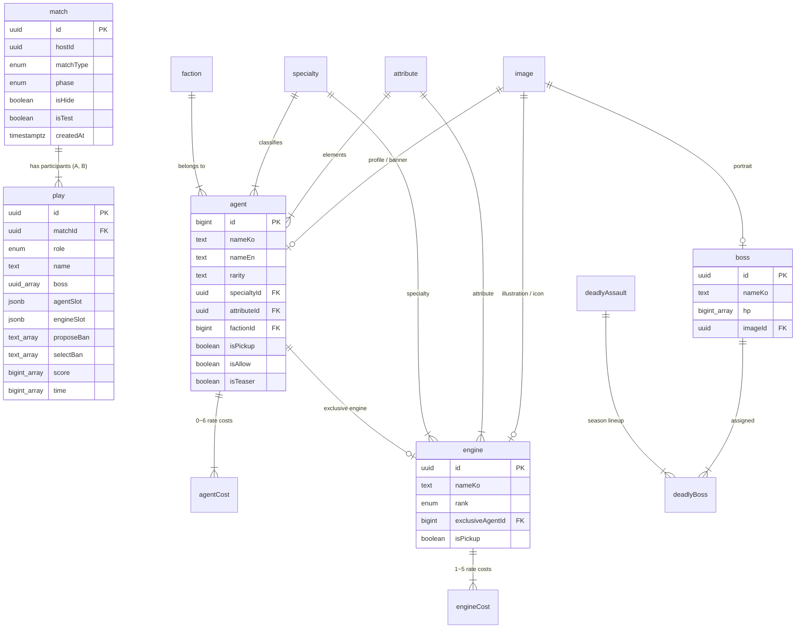

# 데이터베이스 스키마 및 모델 명세 (Database)

`zzz-picker`는 Supabase의 관리형 PostgreSQL(`ap-northeast-2`, Seoul)을 영속성 백엔드로 활용합니다. 실시간 경기 상태(`match`, `play`)와 게임 정적 마스터 데이터(`agent`, `engine`, `boss`, `faction`, `cost`)가 상호 연계되어 운영됩니다.

---

## 1. 데이터베이스 관계도 (Entity Relationship Diagram)



---

## 2. 핵심 테이블 상세 명세

### 2.1 경기 및 실시간 세션 계층

#### 1) `match` (경기 방 마스터)
실시간 경기의 기본 설정, 진행 페이즈, 호스트 식별값을 보관합니다.
- `id` (`uuid`, PK): 경기 고유 번호 (URL 룸 식별자 `roomId`).
- `hostId` (`uuid`): 해당 경기를 개설한 호스트의 고유 식별자.
- `matchType` (`enum`): `original`(정식 24코스트), `legend`(레전드 노코스트), `unlimited`(공허사냥꾼).
- `phase` (`enum`): `commonBossSelect`, `ban`, `banFix`, `pick`, `done`.
- `isHide` (`boolean`, default: `false`): **소프트 딜리트 플래그**. 방치된 미완료 세션을 은닉 처리할 때 사용.
- `isTest` (`boolean`, default: `false`): 테스트 경기 여부.
- `createdAt` (`timestamptz`): 세션 생성 일시.

#### 2) `play` (선수 세션 및 덱 편성)
매치에 참가한 선수 A와 B의 실시간 덱 구성, 밴픽 내역, 점수를 영속화합니다.
- `id` (`uuid`, PK): 참가자 식별자.
- `matchId` (`uuid`, FK ➡️ `match.id`): 소속 매치 번호.
- `role` (`enum`): `'A'` 또는 `'B'`.
- `name` (`text`): 플레이어 닉네임.
- `boss` (`uuid[]`): `[1R 희망 보스, 2R 공용/개인 보스]`.
- `agentSlot` (`jsonb`): 1R/2R 에이전트 편성 및 돌파 배열 `Array<Array<{ id: number, rate: number }>>`.
- `engineSlot` (`jsonb`): 1R/2R W-엔진 장착 및 돌파 배열 `Array<Array<{ id: string, rate: number }>>`.
- `proposeBan` (`text[]`): 밴 제안 캐릭터 ID 배열 (기본 `[null, null]`).
- `selectBan` (`text[]`): 최종 확정 밴 캐릭터 ID 배열 (기본 `[null]`).
- `score` (`bigint[]`): `[1R 클리어 점수, 2R 클리어 점수]`.
- `time` (`bigint[]`): `[1R 소요 초, 2R 소요 초]`.

---

### 2.2 게임 마스터 엔티티 계층

#### 1) `agent` (캐릭터 마스터)
- 호요버스 공식 API와 100% 동기화된 캐릭터 마스터 테이블입니다.
- `id` (`bigint`, PK): 호요버스 공식 캐릭터 ID (e.g. 1011, 1021).
- `nameKo` / `nameEn`: 캐릭터 단축명 (미야비 / Miyabi).
- `fullNameKo` / `fullNameEn`: 캐릭터 공식 풀네임 (호시미 미야비 / Hoshimi Miyabi).
- `rarity` (`text`): 등급 (`'S'`, `'A'`).
- `specialtyId` (`uuid`, FK): 전투 특성 (강공, 격파, 이상, 지원, 방어, 명파, 단조).
- `attributeId` (`uuid`, FK): 속성 (물리, 불, 얼음, 전기, 에테르, 바람, 루멘 등).
- `factionId` (`bigint`, FK): 소속 진영 (e.g. 165576 대공동 6과).
- `isPickup` (`boolean`): 한정 픽업 여부 (1차/2차 밴 대상 필터링에 필수).
- `isAllow` (`boolean`): 해당 경기의 출전 허용 여부.
- `isTeaser` (`boolean`): 공식 출시 전 티저 공개 여부 (밴픽 선택 불가).
- `color` (`text`), `version` (`numeric`): 캐릭터 테마 컬러와 출시 버전.
- `profileImageId`, `bannerImageId` (`uuid`, FK): 프로필 아이콘과 전신 일러스트.
- `createdAt` (`timestamptz`): 등록 일시.

#### 2) `engine` (W-엔진 마스터)
- `id` (`uuid`, PK): 엔진 고유 UUID.
- `nameKo` / `nameEn`: 엔진 이름.
- `rank` (`enum`): 무기 등급 (`'S'`, `'A'`, `'B'`).
- `exclusiveAgentId` (`bigint`, FK ➡️ `agent.id`): 전용 무기 대상 에이전트 (공용은 `null`).
- `specialtyId`, `attributeId` (`uuid`, FK): 대응 특성과 속성.
- `isPickup`, `isTeaser` (`boolean`): 픽업 및 티저 상태.
- `imageId`, `iconImageId` (`uuid`, FK): 일러스트와 아이콘 이미지.

#### 3) `boss` & `deadlyAssault` (보스 및 강습전)
- `boss`: 보스 이름, 페이즈별 HP 배열(`hp: bigint[]`), 초상화 이미지, 레거시 번호(`legacy_id`).
- `deadlyAssault`: 강습전 시즌 오픈 버전.
- `deadlyBoss`: 시즌별 보스 4종(시련 3종 `trial`, 역경 1종 `adversity`) 매핑.

#### 4) 분류 마스터 (`faction`, `specialty`, `attribute`)

| 테이블 | 주요 필드 | 연결 |
| :--- | :--- | :--- |
| `faction` | 호요버스 Camp ID, 한글/영문명, 위키 ID, 로고 이미지 | `agent.factionId` |
| `specialty` | 특성 ID, 한글/영문명, 아이콘 이미지 | `agent.specialtyId`, `engine.specialtyId` |
| `attribute` | 속성 ID, 한글/영문명, 아이콘 이미지 | `agent.attributeId`, `engine.attributeId` |

`agent`에는 표시용 단축명·풀네임, 등급, 색상, 출시 버전, 픽업/허용/티저 상태와 프로필·배너 이미지 연결이 있습니다. `engine`은 등급, 픽업/티저 상태, 특성·속성, 일러스트·아이콘 이미지 및 전용 에이전트 연결을 가집니다.

### 2.3 경기 메타데이터

`match`에는 테스트 여부(`isTest`)와 소프트 삭제 상태(`isHide`)가 있습니다. `play`에는 선수 역할, 닉네임, 보스 배열, 밴 내역, 파티 슬롯, 라운드별 점수와 시간이 저장됩니다.

---

### 2.4 코스트 및 이미지 리소스 계층

#### 1) `agentCost` & `engineCost` (개별 코스트 SSOT)
모든 캐릭터(0~6돌 7개 레코드)와 엔진(1~5돌 5개 레코드)의 코스트가 행 단위로 사전 저장되어 런타임 `useCost` 훅에 즉시 서빙됩니다.
```sql
-- agentCost 레코드 규격
agentId: 1011 | rate: 0 | cost: 0.0
agentId: 1011 | rate: 1 | cost: 0.5
...
agentId: 1011 | rate: 6 | cost: 3.0
```

#### 2) `image` (Cloudflare R2 매핑)
Cloudflare R2 버킷에 업로드된 영구 CDN URL(`https://images.zzz.freevue.dev/...`), 이미지 유형(`agent_profile`, `faction_logo` 등), 설명을 관리합니다.

---

## 3. 연관 위키 문서

- [시스템 아키텍처 및 구현 명세 (architecture.md)](./architecture.md)
- [밴픽 및 코스트 시스템 (banpick-system.md)](./banpick-system.md)
- [운영 및 자동화 가이드 (operations.md)](./operations.md)
- [위키 인덱스로 돌아가기 (index.md)](./index.md)
