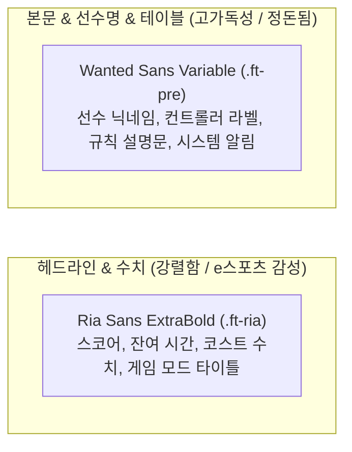

# 디자인 시스템 가이드 (Design System)

`zzz-picker`의 디자인 시스템은 젠레스 존 제로(Zenless Zone Zero) 특유의 카본 다크와 네온 시그니처 톤을 차용한 **퓨어 다크 테크니컬(Pure Dark Technical)** 테마를 채택하고 있습니다.  
상세한 기계 가독형 토큰 스키마와 와이어프레임은 [표준 DESIGN.md](../.agent/rules/DESIGN.md)에서 단일 진실 공급원(SSOT)으로 관리됩니다.

---

## 1. 핵심 철학 및 톤앤매너

1. **퓨어 다크 지향 (Pure Dark Only)**:
   - 라이트 모드를 완전 배제하고, 눈의 피로를 최소화하는 카본 블랙(`--color-base: #0c0f12`)과 시그니처 골드 옐로우(`--color-primary: #ffd215`)를 기본으로 구성합니다.
   - 뷰포트 전체 스크롤 차단(`overflow: hidden`, `overscroll-y-none`)으로 네이티브 데스크톱/모바일 앱과 같은 정돈된 몰입감을 제공합니다.
2. **키네틱 사선 롤링 텍스트 배경 (`Background.tsx`)**:
   - 15개 라인의 거대한 타이포그래피(`text-9xl text-primary/5 ft-ria`)를 -40도 각도로 배치하고, 홀/짝수 라인이 120초 주기로 서로 반대 방향으로 교차 롤링(`rollingBg`)합니다.
   - 브랜딩 키워드: `'엔강대'`, `'엔코르'`, `'앨리스'`, `'타임필드'`.
3. **면(Surface) 중심 레이어링 및 명도 단차**:
   - 인위적인 1px 선을 지양하고, 4단계의 명도 단차(`Base` ➡️ `Content` ➡️ `Neutral` ➡️ `Elevated`)로 정보 계층을 분리합니다.

---

## 2. 디자인 토큰 빠른 참조

| CSS 변수 토큰 | 색상값 (HEX) | Tailwind 유틸리티 | 주요 적용처 |
| :--- | :--- | :--- | :--- |
| `--color-base` | `#0c0f12` | `bg-base`, `bg-background` | 최하단 메인 뷰포트 배경 |
| `--color-content` | `#141920` | `bg-content`, `bg-card` | 주요 카드 컨테이너 (`.card`) |
| `--color-netural` | `#1c2331` | `bg-netural`, `bg-muted` | 비활성 서브 면, 단차 패널 |
| `--color-elevated` | `#252f42` | `bg-elevated`, `bg-accent` | 인풋 필드, 비활성 슬롯, 모달 |
| `--color-primary` | `#ffd215` | `text-primary`, `bg-primary` | 시그니처 골드, 메인 CTA, 활성 보더 |
| `--color-secondary` | `#00f0ff` | `text-secondary`, `bg-secondary` | 네온 시안, 복사 버튼, 실시간 접속 펄스 |
| `--color-tertiary` | `#ff4500` | `text-tertiary`, `bg-destructive` | 시그널 오렌지 레드, 코스트 초과 경고 |
| `--color-chip` | `#a855f7` | `border-chip`, `bg-chip/30` | 바이올렛 메타데이터 칩(`Chip`) |
| `--color-ink` | `#ffffff` | `text-ink`, `text-foreground` | 순백색 본문 및 헤더 텍스트 |
| `--color-disabled` | `#374151` | `text-disabled` | 비활성화 텍스트 및 그레이스케일 |

---

## 3. 타이포그래피 계층 (Typography)



- **`.ft-ria` (Ria Sans ExtraBold)**: 800 웨이트의 강렬한 자형. 숫자와 영문 헤드라인의 시인성을 극대화합니다.
- **`.ft-pre` (Wanted Sans Variable)**: 자간과 장평이 최적화된 기하학적 산세리프. 모든 정보성 본문과 UI 라벨의 표준입니다.

---

## 4. 마이크로 인터랙션 및 상태 머신

### 4.1 회전하는 코닉 테두리 (`.card.active`)
선택된 에이전트 또는 확정 대기 카드에 젠레스 존 제로 특유의 회전하는 네온 옐로우 보더 효과를 적용합니다.
```css
.card.active::before {
  content: '';
  position: absolute;
  inset: -50%;
  animation: spin 3s linear infinite;
  background: conic-gradient(
    var(--color-primary) 0%,
    var(--color-primary) 25%,
    transparent 25%,
    transparent 50%,
    var(--color-primary) 50%,
    var(--color-primary) 75%,
    transparent 75%,
    transparent 100%
  );
}
```

### 4.2 실시간 접속 인디케이터 (`Pulse`)
- **온라인 (정상 수신)**: `size-4 rounded-full bg-secondary animate-pulse` (청록색 펄스)
- **오프라인 (지연/단절)**: `size-4 rounded-full bg-red-400` (빨간색 고정)

### 4.3 월페이퍼 뷰 트랜지션 (Chrome View Transition API)
- 갤러리 카드 클릭 시 CSS 뷰 트랜지션 의사 요소(`::view-transition-group(.wallpaper-top)`)를 활용하여 부드러운 풀스크린 줌 모션을 브라우저 네이티브로 구현했습니다.

---

## 5. UI 개발 Do's and Don'ts

| 구분 | 규칙 및 가이드라인 |
| :--- | :--- |
| **DO** | • 모든 신규 컴포넌트는 다크 카본(`bg-base`, `bg-content`)을 베이스로 제작합니다.<br>• 정보 계층 구분이 필요할 때는 테두리 대신 `bg-neutral`, `bg-elevated`의 명도 차이를 사용합니다.<br>• 점수, 코스트, 타이머 수치에는 반드시 `.ft-ria`를 적용합니다.<br>• 버튼은 알약형(`rounded-full`)을 우선 적용합니다. |
| **DON'T** | • 라이트 모드용 흰색/밝은 회색 배경을 절대 주입하지 않습니다.<br>• 1px `border-gray-500`과 같은 고대비 회색 테두리를 남발하지 않습니다.<br>• 긴 문장의 본문 텍스트에 `.ft-ria`를 사용하지 않습니다 (가독성 저하).<br>• 루트 뷰포트에 의도치 않은 이중 스크롤바가 발생하지 않도록 합니다. |

---

## 6. 연관 위키 문서

- [표준 DESIGN.md 명세서 (Two Layers)](../.agent/rules/DESIGN.md)
- [시스템 아키텍처 및 라우트 (architecture.md)](./architecture.md)
- [위키 인덱스로 돌아가기 (index.md)](./index.md)
