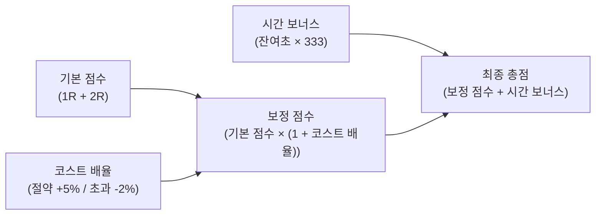

# 경기 규칙 및 점수 체계 (Game Rules)

`zzz-picker`는 젠레스 존 제로(Zenless Zone Zero)의 고난도 엔드 콘텐츠인 **강습전(Deadly Assault)**을 기반으로, 2명의 참가자(A선수, B선수)와 1명의 호스트(H)가 실시간으로 보스 선택, 밴픽, 파티 구성을 진행하고 최종 점수를 겨루는 경기 플랫폼입니다.

---

## 1. 강습전 기본 규칙

- **진행 방식**: 단판 승부로 진행되며, 총 2개 라운드(**1Round**, **2Round**)로 구성됩니다.
- **보스 구성**: 강습전 시즌에 배정된 3종의 강력한 보스 중 선택하여 대결합니다.
- **제한 시간**: 라운드당 **3분 (180초)** 기준입니다.
- **파티 구성 제약**:
  - 각 라운드마다 **3명의 에이전트**와 선택적으로 **W-엔진**을 장착합니다.
  - **중복 출전 불가**: 1라운드에 출전한 에이전트와 엔진은 2라운드에 다시 출전할 수 없습니다. (선수당 총 6명의 독립된 에이전트 운용)

---

## 2. 3대 경기 모드 (Match Types)

방 개설 시 선택 가능한 3가지 경기 모드에 따라 보스 선택 권한과 코스트 제한 룰이 달라집니다.

| 경기 모드 | 모드 키 (`MatchType`) | 보스 선택 방식 | 코스트 제한 및 특징 |
| :--- | :--- | :--- | :--- |
| **정식 로프꾼** | `original` | 1R: 각 선수 희망 보스 개별 선택 2R: B선수가 선택한 공용 보스 공통 대결 | **24 Cost 제한** • 잔여 코스트 비례 가산점 • 초과 코스트 비례 페널티 감점 |
| **레전드 로프꾼** | `legend` | 1R: 각 선수 희망 보스 개별 선택 2R: B선수가 선택한 공용 보스 공통 대결 | **Cost 무제한** 밴픽 전략과 자유로운 조합에 집중 |
| **공허사냥꾼** | `unlimited` | 1R/2R: 각 선수가 임의의 보스를 자유 선택 (공용 보스 선택 및 밴 페이즈 생략) | **Cost 무제한** 빠른 경기 진행을 위한 프리 모드 |

---

## 3. 점수 계산 공식 (Score Calculation)

경기 종료 후 호스트가 각 선수의 1R 및 2R **클리어 기본 점수**와 **소요 시간(초)**을 입력하면 시스템이 다음 수식에 따라 최종 총점을 자동으로 집계합니다.

### 3.1 시간 보너스 점수 (`calcTimeScore`)
180초(3분) 이내에 보스를 클리어했을 때 남은 잔여 시간에 비례하여 보너스 점수가 부여됩니다.

$$\text{시간 보너스} = \max(180 - \text{소요 시간(초)}, 0) \times 333\text{점}$$

- 180초 초과 시 시간 보너스는 0점입니다.
- 1R 시간 보너스와 2R 시간 보너스는 각각 계산되어 합산됩니다.

### 3.2 코스트 배율 (`calcCostBonuse`) - 정식 로프꾼 전용
기준 코스트는 **24 Cost**이며, 1R와 2R에서 사용한 총합 코스트에 따라 배율이 결정됩니다.

1. **코스트 절약 시 ($\text{사용한 Cost} \le 24$)**:
   - 남은 1 Cost마다 기본 점수에 **+5% (0.05)**의 보너스 배율이 가산됩니다.
   $$\text{코스트 배율} = (24 - \text{사용한 Cost}) \times 0.05$$
2. **코스트 초과 시 ($\text{사용한 Cost} > 24$)**:
   - 초과한 1 Cost마다 기본 점수에서 **-2% (0.02)**의 페널티 감점이 적용됩니다.
   $$\text{코스트 배율} = (24 - \text{사용한 Cost}) \times 0.02 \quad (\text{음수 값})$$

> `레전드 로프꾼` 및 `공허사냥꾼` 모드는 코스트 배율이 0(즉 $1 + 0 = 1$)으로 고정됩니다.

### 3.3 최종 총점 공식

$$\text{최종 총점} = \Big[(\text{1R 점수} + \text{2R 점수}) \times (1 + \text{코스트 배율})\Big] + (\text{1R 시간 보너스} + \text{2R 시간 보너스})$$

- 최종 총점이 더 높은 선수가 해당 경기의 승자가 됩니다.

---

## 4. 연관 위키 문서

- [밴픽 및 코스트 시스템 (banpick-system.md)](./banpick-system.md)
- [시스템 아키텍처 및 화면 흐름 (architecture.md)](./architecture.md)
- [위키 인덱스로 돌아가기 (index.md)](./index.md)
