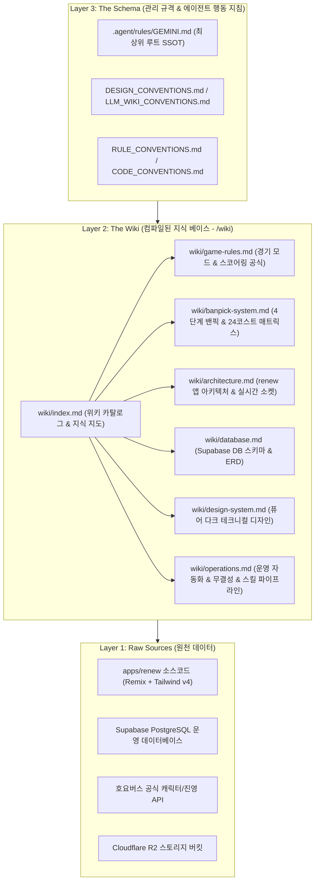
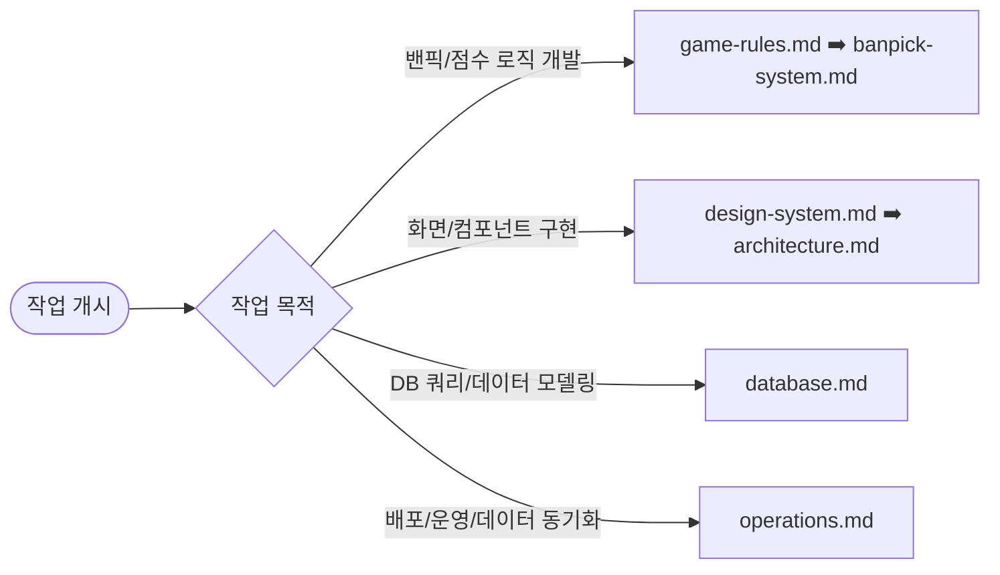

# ZZZ-Picker LLM Wiki

> **"한 번 컴파일하고, 계속 재사용하라 (Compile once, reuse often)."**  
> 본 위키는 Andrej Karpathy의 컴파일-우선(Compilation-First) 지식 엔진 아키텍처를 기반으로 구축된 `zzz-picker`의 지속적이고 구조화된 도메인 지식 베이스(Single Source of Truth)입니다.

---

## 1. 3계층 아키텍처 (The 3-Layer Architecture)

본 위키는 런타임 소스코드(Layer 1)와 최상위 메타 룰(Layer 3) 사이에서, 인간 개발자와 AI 에이전트가 공유하는 **핵심 컴파일 지식 계층(Layer 2: The Wiki)** 역할을 수행합니다.

---

## 2. 위키 문서 카탈로그 (Wiki Catalog)

| 문서명 | 파일 링크 | 주요 내용 및 다루는 주제 |
| :--- | :--- | :--- |
| **경기 규칙** | [game-rules.md](./game-rules.md) | 라운드 진행 방식, 3대 경기 모드(공허사냥꾼/정식/레전드), 소요시간 보너스 공식, 잔여 코스트 가산점 |
| **밴픽 시스템** | [banpick-system.md](./banpick-system.md) | 4단계 Phase(공용보스 ➡️ 1차 제안밴 ➡️ 2차 확정밴 ➡️ 픽), 24 코스트 매트릭스, 중복 출전 제한 |
| **시스템 아키텍처** | [architecture.md](./architecture.md) | `@zzz-picker/renew` 라우트 구성, PlayGround 및 HostDashboard 컴포넌트, Supabase Realtime 브로드캐스트 이벤트 |
| **데이터베이스 명세** | [database.md](./database.md) | PostgreSQL 운영 스키마, 6대 핵심 테이블(agent, engine, boss, deadlyAssault, match, play), ERD 다이어그램 |
| **디자인 시스템** | [design-system.md](./design-system.md) | Google Labs `DESIGN.md` 요약, 퓨어 다크 토큰, 키네틱 롤링 배경, 마이크로 인터랙션, shadcn UI 매핑 |
| **운영 및 자동화** | [operations.md](./operations.md) | 5대 무결성 검사(`sync-match-integrity`), 호요버스 API 로스터 등록, R2 이미지 업로드, 디스코드 웹훅 규격 |

---

## 3. 목적별 빠른 질의 시나리오 (Fast Query Scenarios)

에이전트나 개발자가 특정 작업을 수행할 때 아래 권장 경로로 위키 문서를 탐색하면 최소한의 탐색 비용으로 고정밀 맥락을 획득할 수 있습니다.

1. **경기 룰 및 밴픽 알고리즘 작업**:
   - `wiki/game-rules.md`를 통해 라운드별 점수식과 모드별 코스트 제약을 확인합니다.
   - `wiki/banpick-system.md`에서 4단계 Phase의 상태 전이 순서와 돌파별 코스트 매트릭스를 확인합니다.
2. **UI 컴포넌트 및 인터랙션 개발**:
   - `wiki/design-system.md` 및 `.agent/rules/DESIGN.md`에서 컬러 토큰, 폰트, 반응형 기준을 파악합니다.
   - `wiki/architecture.md`에서 PlayGround(모바일)와 HostDashboard(데스크톱 3단 분할)의 슬롯 배치를 확인합니다.
3. **실시간 통신 및 상태 동기화**:
   - `wiki/architecture.md`의 Realtime 이벤트 시퀀스 섹션을 참조하여 브로드캐스트 페이로드를 구성합니다.
4. **데이터 무결성 점검 및 로스터 등록**:
   - `wiki/operations.md`의 5대 무결성 체크리스트 및 자동 등록 스킬 파이프라인을 확인합니다.

---

## 4. 상위 규격 및 원천 링크

- **최상위 지식 가이드 (SSOT)**: [`.agent/rules/GEMINI.md`](../.agent/rules/GEMINI.md)
- **표준 디자인 시스템 명세**: [`.agent/rules/DESIGN.md`](../.agent/rules/DESIGN.md)
- **에이전트 레포 지침**: [`AGENTS.md`](../AGENTS.md)
