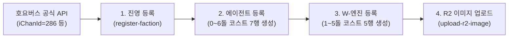

# 운영 및 자동화 파이프라인

`zzz-picker`는 안정적인 경기 데이터 수명주기 관리와 신속한 신규 콘텐츠 확장을 위해 고도화된 자동화 스킬(Skills) 및 운영 파이프라인을 갖추고 있습니다.

---

## 1. 경기 데이터 무결성 및 수명주기 관리 (`sync-match-integrity`)

실시간 웹 서비스 특성상 방 생성 후 이탈하거나 중단된 방치 세션이 발생합니다. 데이터 유실을 방지하고 통계의 신뢰성을 확보하기 위해 **물리적 DELETE를 전면 배제하고 `isHide` 플래그 기반 소프트 딜리트** 정책을 적용합니다.

```mermaid
flowchart TD
    Start([경기 세션 진단]) --> C5{"[5] 생성 후 24시간 경과?"}
    C5 -->|No (24시간 이내)| Grace["🟡 [진행 중 세션] 상태 보존 (Grace Period)"]
    C5 -->|Yes| C1{"[1] 선수 2명 완결?<br/>(A/B 각 1명)"}
    
    C1 -->|Fail| Hide["🔴 [소프트 딜리트]<br/>isHide = true 처리"]
    C1 -->|Pass| C2{"[2] 보스 2개 완결?<br/>(1R/2R 유효 UUID)"}
    
    C2 -->|Fail| Hide
    C2 -->|Pass| C3{"[3] 파티 6슬롯 완결?<br/>(1R 3인 + 2R 3인)"}
    
    C3 -->|Fail| Hide
    C3 -->|Pass| C4{"[4] 점수 유효 기록?<br/>(score > 0)"}
    
    C4 -->|Fail| Hide
    C4 -->|Pass| Done["🟢 [정상 완료 승격]<br/>phase = 'done' 자동 보정"]

    Done --> Webhook["📢 디스코드 동기화 브리핑 전송"]
    Hide --> Webhook
```

### 1.1 5대 정밀 무결성 체크리스트

| 번호 | 검사 항목 | 검사 대상 필드 | 통과 기준 (PASS) | 이상치 판정 시 조치 |
| :---: | :--- | :--- | :--- | :--- |
| **1** | **참가자 완결성** | `play.id`, `role` | A선수 1명, B선수 1명 **정확히 2명** 존재 | 24시간 경과 시 `isHide = true` |
| **2** | **보스 선택 완결성** | `play.boss` | 1R/2R 보스 2종 모두 유효한 UUID로 지정 | 24시간 경과 시 `isHide = true` |
| **3** | **파티 슬롯 완결성** | `play.agentSlot` | 1R(3명) + 2R(3명) **총 6개 슬롯 모두 캐릭터 ID 존재** | 24시간 경과 시 `isHide = true` |
| **4** | **점수 기록 완결성** | `play.score`, `time` | 실제 클리어 점수가 1건이라도 양수 기록 (`score > 0`) | 24시간 경과 시 `isHide = true` |
| **5** | **유예 기간 (Grace)** | `match.createdAt` | 생성 후 **24시간 이내** 세션은 진행 중으로 인정 | 어떠한 변경도 가하지 않고 보존 |

### 1.2 2-Pass 라이프사이클 처리
1. **🟢 정상 완료 승격**: 5대 항목을 모두 만족하지만 호스트가 종료 버튼을 누르지 않아 `'pick'` 상태로 남아있던 경기를 정식 완료(`phase = 'done'`)로 승격하여 플레이어의 기록을 구제합니다.
2. **🔴 비정상 세션 은닉**: 항목 1~4 중 결손이 발생한 채 24시간 이상 방치된 방을 `isHide = true`로 처리하여 랭킹 및 대시보드 조회에서 제외합니다.

---

## 2. 신규 로스터 자동 등록 파이프라인

새로운 버전이 업데이트될 때 호요버스 공식 콘텐츠 API를 조회하여 무중단으로 신규 캐릭터/진영/무기를 적재합니다.



1. **진영 자동 등록 (`register-faction`)**:
   - 호요버스 공식 Camp API를 조회하여 진영 고유 ID, 한글명, 영문명, 로고 이미지를 Supabase `faction` 테이블에 등록합니다.
2. **에이전트 및 코스트 등록 (`roster-auto-registration`)**:
   - 에이전트 마스터(`agent`) 생성 후, 5대 표준 코스트 프리셋 중 하나를 선택하여 `agentCost` 테이블에 **0~6돌 7개 행**을 원자적(Atomic)으로 삽입합니다.
3. **W-엔진 및 코스트 등록**:
   - 전용 무기 연결 및 `engineCost` 테이블에 **1~5돌 5개 행**을 삽입합니다.

---

## 3. Cloudflare R2 스토리지 이미지 업로드 (`upload-r2-image`)

- **스토리지 엔드포인트**: Cloudflare R2 버킷 (`zzz-picker`).
- **퍼블릭 CDN 도메인**: `https://images.zzz.freevue.dev`
- **실행 스크립트**:
  ```bash
  npx tsx .cursor/skills/upload-r2-image/scripts/upload.ts \
    --url <외부원본URL> --path <R2경로prefix>
  ```
- **원칙**: 대량 작업 시 매니페스트 없이 단건 업로드를 순차 반복 실행하여 실패 시 격리 복구가 가능하도록 합니다.

---

## 4. 디스코드 규격화 알림 시스템 (`send-discord-webhook`)

시스템 주요 이벤트 발생 시 디스코드 웹훅을 통해 정형화된 임베드 카드로 운영진에게 브리핑을 전달합니다.

### 4.1 3대 메시지 블록 규격
1. **무결성 동기화 브리핑**:
   - 승격된 정상 경기 수, 소프트 딜리트된 방치 세션 수, 전체 유효 경기 통계를 정돈된 필드로 요약 보고.
2. **일반 안내 및 릴리즈 알림**:
   - 신규 캐릭터/시즌 개막 소식을 전달하는 미니멀 알림.
3. **시스템 장애 긴급 보고 (`system-failure`)**:
   - 작업 실패 시 실패 작업명, 발생 원인, 스택 트레이스를 빨간색 강조 임베드로 즉각 전송하여 빠른 복구를 지원.

---

## 5. 연관 위키 문서

- [데이터베이스 스키마 명세 (database.md)](./database.md)
- [경기 규칙 및 점수 체계 (game-rules.md)](./game-rules.md)
- [등록 및 유지보수 상세 문서](operations/roster-auto-registration.md)
- [위키 인덱스로 돌아가기 (index.md)](./index.md)

## 상세 운영 문서

| 작업 | 상세 문서 |
| :--- | :--- |
| 공통 등록 안전 수칙 | [roster-auto-registration.md](operations/roster-auto-registration.md) |
| 에이전트 / W-엔진 / 보스 등록 | [agent](operations/agent-registration.md) · [engine](operations/engine-registration.md) · [boss](operations/boss-registration.md) |
| 진영 / 특성 / 강습전 시즌 등록 | [faction](operations/faction-registration.md) · [specialty](../.agent/skills/register-specialty/SKILL.md) · [assault](operations/assault-registration.md) |
| 호요버스 데이터 출처 | [hoyoverse-character-api.md](operations/hoyoverse-character-api.md) |
| 경기 무결성 및 웹훅 | [data-integrity-cleanup.md](operations/data-integrity-cleanup.md) · [discord-webhook-notification.md](operations/discord-webhook-notification.md) |
| DB 이관 이력 | [migrations/index.md](operations/migrations/index.md) |

실제 등록·동기화·알림 실행은 상세 지식 문서와 대응하는 [레포 스킬](../.agent/skills/)을 함께 확인합니다. 문서는 검증 기준과 결정 사항을, 스킬은 현재 런타임에서 실행할 절차를 설명합니다.
