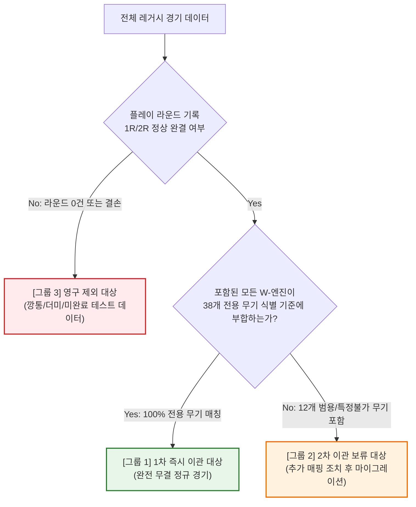

# 2026-09-06 레거시 경기 로그 1차 무결성 이관 명세서

> [!NOTE]
> - **작업 일자**: 2026-09-06
> - **상위 인덱스**: [마이그레이션 허브 (index.md)](./index.md)
> - **작업 목적**: 과거 5단계 정규화 경기 로그를 `@zzz-picker/renew` 스키마로 이관함에 있어, 데이터 왜곡과 오탐을 방지하기 위해 1차 이관 대상과 보류 대상을 엄격히 구분하고 단계별 실행 기준을 정의합니다.
> - **운영 원칙**: 원본 레거시 테이블은 오직 **SELECT (읽기 전용)**로만 접근하며 절대 변경/삭제하지 않습니다.

---

## 1. 마이그레이션 데이터 분류 기준 (Classification Criteria)

데이터의 완결성과 식별 정확도에 따라 전체 레거시 경기를 **3가지 그룹**으로 명확히 분류하여 단계적으로 처리합니다.

---

## 2. 그룹별 처리 규칙 상세

### [그룹 1] 1차 즉시 이관 대상 (Phase 1 Eligible) - 총 39건
- **자격 기준**:
  1. 1라운드(`personal`)와 2라운드(`common` 또는 `unlimited`)가 모두 정상 완결된 경기.
  2. 양 팀(A/B) 선수 2명의 파티 및 점수/시간 데이터가 유효하게 존재하는 경기.
  3. 경기에 사용된 모든 W-엔진이 **100% 특정이 확인된 38종 전용 무기**이거나 무기를 미장착(빈 슬롯)한 경기.
  4. 테스트 데이터 및 중복 제출 세션 제외 필터 통과 경기.
- **처리 방침**:
  - `apps/renew`의 `match` 및 `play` 테이블로 안전하게 이관.
  - 데이터 오탐 및 왜곡 위험 0% 보장.

### [그룹 2] 2차 이관 보류 대상 (Phase 2 Pending) - 총 52건
- **자격 기준**:
  1. 경기는 1R/2R 정상 완결되었으나, 사용된 무기 중 **복수 캐릭터 공유/범용 무기로 분류된 12종 W-엔진 ID**가 최소 1개 이상 포함된 경기.
- **처리 방침**:
  - **1차 마이그레이션 실행 시 적재를 보류(Skip)**.
  - 범용 무기 매핑 테이블이 추가로 확정되거나 기본값 대체 정책이 수립된 후, 2차 추가 조치 작업을 거쳐 마이그레이션 진행.

### [그룹 3] 영구 제외 대상 (Permanently Skipped) - 총 7건
- **자격 기준**:
  1. 방만 생성되고 라운드 및 파티 데이터가 0건인 깡통 매치 (49, 66, 67, 82번).
  2. 개발 단계 테스트 데이터 또는 점수/시간이 모두 0으로 방치된 미완료 경기 (14번: `test1` vs `test2`).
  3. 동일 일시/점수로 수 초~수 분 내 중복 제출된 세션 (29번: 28번의 31초 중복, 37번: 36번의 4분 중복).
- **처리 방침**:
  - 마이그레이션 대상에서 완전 제외하여 신규 시스템의 통계 오염 방지.

---

## 3. 필드별 변환(ETL) 및 정규화 규칙

### 1) 매치 기본 테이블 (`match`)
- **`id`**: 신규 UUID 생성 (`crypto.randomUUID()`)
- **`hostId`**: **매 경기마다 새롭게 독립된 UUID 생성** (`crypto.randomUUID()`)
- **`matchType`**: 소문자 정규화 (`original`, `legend`, `unlimited`)
- **`phase`**: 완료된 경기이므로 `'done'` 고정
- **`created_at`**: 레거시 `mach_at` 타임스탬프 원형 보존
- **`isTest`**: 정규 경기이므로 `false` 고정

### 2) 선수 세션 및 파티 테이블 (`play`)
- **`id`**: 신규 UUID 생성
- **`matchId`**: 상위 `match.id` 외래키 연결
- **`role`**: `'A'` 및 `'B'` 2개 행 분할 생성
- **`name`**: 레거시 A선수(`a_name`) 및 B선수(`b_name`) 닉네임 매핑
- **`boss`**: 1R/2R 보스 배열 `[1R_boss_uuid, 2R_boss_uuid]` (`boss.legacy_id`로 100% 치환)
- **`agentSlot`**: 1R/2R 에이전트 3인 슬롯 `Array<Array<{ id, rate }>>`
- **`engineSlot`**: 1R/2R W-엔진 슬롯 `Array<Array<{ id, rate }>>` (식별된 전용 무기 UUID 매핑)
- **`selectBan`**: **`[B선택, A선택]` 순서로 정렬하여 양측 선수(A/B) 모두에게 동일 주입**  
  *(단, `unlimited` 등 밴이 없는 경기는 `[null]` 주입)*
- **`proposeBan`**: 레거시 미수집 데이터이므로 스키마 표준 규격인 **`[null, null]`** 고정
- **`score`**: 1R/2R 클리어 점수 배열 `[1R, 2R]`
- **`time`**: 1R/2R 소요 시간(초) 배열 `[1R, 2R]`

---

## 4. 마이그레이션 파이프라인 (Dry-Run ➡️ Verify ➡️ Commit)

1. **Step 1 (Dry-Run)**: 분류 규칙에 따라 [그룹 1] 대상 선별 및 사전 정밀 진단(14번 테스트, 29/37번 중복 식별).
2. **Step 2 (Verify)**: 사용자 승인 하에 최종 39건 확정, 모든 외래키(보스 14종, 에이전트 38종) 결손율 0% 사전 확인.
3. **Step 3 (Transaction Commit)**: Supabase PostgreSQL 트랜잭션(`BEGIN ... COMMIT`) 단위로 안전하게 일괄 적재 완료.

---

## 5. 실행 결과 (Execution Result - 2026-09-06)

- **적재 상태**: **성공 (Commit 완료)**
- **이관 매치 수**: **39건** (신규 UUID 기반 `match` 레코드 생성)
- **이관 플레이 수**: **78건** (A선수 39건, B선수 39건 `play` 레코드 생성)
- **제외 처리 매치**:
  - `14번`: 점수 0 방치 개발 테스트 방 (영구 제외)
  - `29번`: 28번 매치의 31초 간격 중복 제출 (영구 제외)
  - `37번`: 36번 매치의 4분 간격 중복 제출 (영구 제외)
- **무결성 사후 검증 결과**:
  - 고아 플레이(`orphan_play`) 레코드: **0건**
  - 보스/에이전트/엔진 외래키 결손: **0건**
  - 전체 완료 공식 경기 수: 1건 ➡️ **40건**으로 정상 반영

